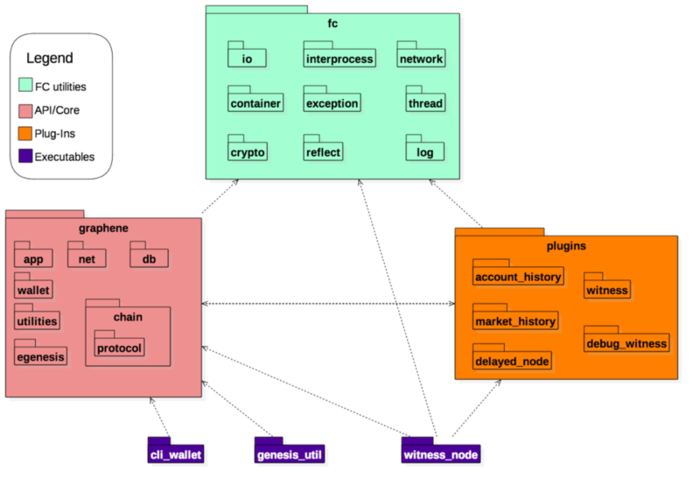
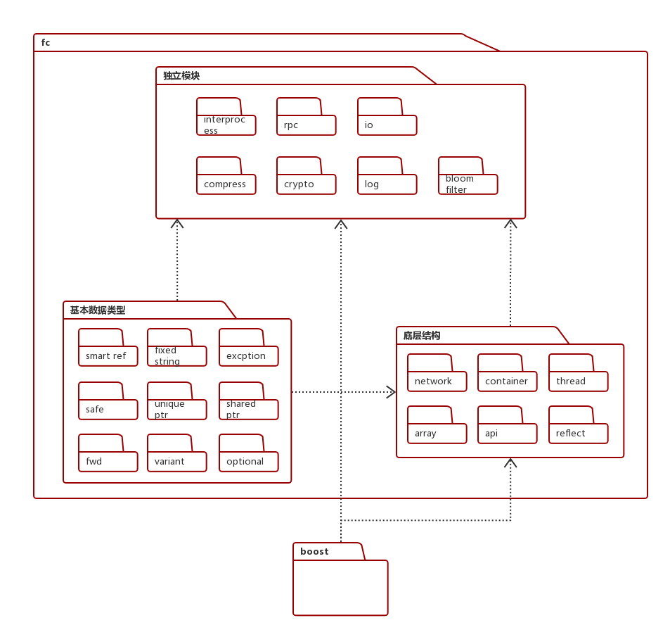

# EOS代码分析

> Author : huziang <br>
>
> Date : 2018年5月22日 星期二 上午11:33

## EOS代码组成

- EOS.IO项目由四部分组成，如图所示：

  值得一提的是，虽然EOS和bitcoin底层都是graphene，但EOS对代码进行了重构，和bitcoin的底层实现不一样。



1. fc：依赖boost层，构造的通用底层工具，包含最基本的功能。
2. graphene：依赖fc层，实现的EOS模块，模块实现白皮书中的各个功能。
3. plugins：依赖fc层，实现的EOS插口，是graphene层的功能延伸，即插即用。
4. executables：可执行程序，例如noeosd，cleos等命令行运行程序。

## fc层：

#### 一些有意思的东西，在此分享一下，可以跳过。

- fc层中几个声明空间的说明：

  - detail空间：内部函数或者内部类/基类/虚类的实现一般放在fc::detail空间（即外部用不到）。封装好的函数或者类则放在fc空间，供外部使用。

    1. 如果需要封装基类供外部使用，则在fc::detail空间内添加\_impl类，该类实现基类的函数，基类则包含\_impl类指针，调用同名函数。例如：

       ~~~c++
       // hpp
       namespace detail {
         class test_impl;
       }
       
       class test {
       public:
         void testfunc();
       
       private:
         std::unique_ptr<detail::test_impl> impl;
       };
       
       // cpp
       namespace detail {
         class test_impl {
         public:
           void testfunc() {
             // to do something
           }
         };
       } // namespace detail
       
       void test::testfunc() { 
         impl->testfunc(); 
       }
       ~~~

    2. 如果需要封装派生类供外部使用，则在fc::detail空间内添加_base类，派生类继承\_base类。例如：

       ~~~c++
       // hpp
       namespace detail {
       class test_base {
       public:
         void init();
       };
       
       void test_base::init() {
         // to do something
       }
       } // namespace detail
       
       class test : public detail::test_base {
       public:
         void testfunc();
       };
       
       // cpp
       void test::testfunc() { 
         this->init();
         // to do something
       }
       ~~~

  - raw空间：存放pack和unpack函数，做类型和流之间的转换。

####fc内部结构：

- fc层结构如下：

  

- compress：将字符串进行压缩，包含smaz和zlib两种模式。

- container：把deque，flat_set，flat_map（boost::container中的结构），vector（std::vector）打包成Stream流。或者把Stream流拆包成给定结构。

- crypto：加密算法，包含sha，aes等算法。

- excption：自定义错误。

- interprocess：

  自定义进程，以boost::process的进程为基础，构建的iprocess接口和process实现。在interprocess文件夹中，还实现了file_mapping，mapped_region，mmap_struct三个结构，前两个结构基于pwd实现。

  process内部可以声明子进程，声明管道，抛出异常信号等，和boost::process相差不大。

- pwd：fc内部实现的内存分配结构，通过模版，指定类型T，数据长度S，内存对齐长度Align，通过union巧妙的实现内存对齐，并且重定义*和->，使用户使用的时候可以直接访问内部存储的指定类型T。并且通过forward实现转发。

- io：io部分，分为很多文件模块。

  - buffered_iostream：采用类似的结构，在impl（实现中），结构如下：

    用户->\_rdbuf->\_shared\_xxx\_buffer->\_istr/\_ostr

    其中部分函数内置锁。

  - datastream：数据流。看起来很迷，模版类型T很像是指针，指向char*字符串，那为何不直接用char\*这种指针？？反正很迷。

  - enum_type：枚举类型，和variant类直接联系。

  - iobuffer：用vector\<char\>实现的流。

  - json/json_relaxed：自我实现的json库。

- log：log部分，分为很多文件模块。

  - appender：其中包含appender_factor和appender。通过模版和继承结合使用，巧妙的实现了多态。通过unordered_map的使用，实现了工厂类和工厂类生产函数。

- network：基本网络部分，内部包含ip，url的定义实现，还有udp_socket的实现（基于boost），没有什么特殊的。

- reflect：reflect部分，分为很多文件模块。

  - typename：get_typename类型定义，通过get_typename\<int8_t\>::name()这种方式使用。
  - reflect：反射实现部分，有很多宏定义，通过宏定义实现模版特例化，达到反射的效果。

- rpc：互联网rpc通讯部分，分为很多文件模块。

  - api：api程序基类，通过宏定义和模版实现vtable类，然后通过实现好的vtable类实现api实例。

  - api_connection / binary_api_connection：包含api_connection和binary_api_connection，两个文件不能同时引用。两者都在std::function的基础上，重新定义了api接口。文件中类关系紧密，耦合度高。

    api_connection的基本api接口函数为std::function\<variant(variants&)\>和std::function\<void(variants&)\>。

    binary_api_connection的基本api接口函数为std::function\<vector\<char\>(vector\<char\>&)\>和std::function\<void(vector\<char\>&)\>。

  - json_connection：类似于api_connection，将variant或exception转成json格式，json_connection使用buffered_ostream_ptr和buffered_istream_ptr进行连接。

  - http_api：实现了基于http请求的api实现。即通过http请求传递函数姓名和参数，调用函数。

  - cli：将api_connection简单的包装一下，并未真正的实现。

- bloom_filter：一种空间效率很高的随机结构。原理：使用多hash函数的hash表，查找的时候，需要全部hash函数都能找到才行，可见[此博客](http://www.cnblogs.com/heaad/archive/2011/01/02/1924195.html)。

  项目中实现的bloom_filter实际只有一个hash函数，通过加"盐"达到不同hash函数的效果。

- variant：内部实现的object基类。variant类中的结构不仅仅可以表示int，double，int_64这种基本结构。还有string，variant\_object，mutable\_variant\_object，variants(vector\<variant\>)这类容器。

  variant内部包含了一个double类型储存data和一个char[sizeof(void\*)]类型储存type，大小为16个字节（64位）。当储存基本类型的时候，该值直接覆写在this处；当储存容器类型的时候，容器的指针覆写在this处。char[sizeof(void\*)]的最后一个byte保存类型。

- variant_object / mutable_variant_object：两者类似，都是使用vector和entry结构（包含key-value：key-string；value-variant）构造字典，没有任何优化措施。区别在于variant_object内部是shared_ptr，mutable_variant_object内部是unique_ptr。

- shared_ptr：内部自己实现的shared_ptr，使用std::atomic库实现原子性操作，可以在多线程之间使用。

- unique_ptr：内部自己实现的unique_ptr，由于是unique，不需要原子性操作。

- optional：即除了正常的类型以外，将空（NULL）也设置成其中的一个类型，而不是仅仅把0视为NULL。

- safe：防止溢出的结构，通过std::numeric_limits\<T\>获取类型的最大值和最小值来判断是否溢出，如果溢出抛出错误。

### 我个人认为的闪光点和学到的知识：

1. pwd：

   ~~~c++
   template<unsigned int S, typename T=double>
   struct aligned {
   union {
     T    _align;
     char _data[S];
   } _store;
   operator char*()            { return _store._data; }
   operator const char*()const { return _store._data; }
   };
   
   template<typename T,unsigned int S, typename Align=double>
   class fwd {
     public:
       template<typename U> fwd( U&& u );
       template<typename U, typename V> fwd( U&& u, V&& v );
       template<typename U, typename V, typename X, typename Y> fwd( U&& u, V&& v, X&&, Y&& );
       fwd();
   
       fwd( const fwd& f );
       fwd( fwd&& f );
   
       operator const T&()const;
       operator T&();
   
       T& operator*();
       const T& operator*()const;
       const T* operator->()const;
   
       T* operator->();
       bool operator !()const;
   
       template<typename U>
       T& operator = ( U&& u );
   
       T& operator = ( fwd&& u );
       T& operator = ( const fwd& u );
   
       ~fwd();
       
     private:
       aligned<S,Align> _store;
   };
   ~~~

   通过模版，实现不同类的储存，转发。

   优点：用union实现内存对齐。通过new操作符，将类型T构造在this地址上，再通过重载*和->，达到和普通类型同样的效果，非常巧妙。

   缺点：由于*和->强制转换次数较多，效率问题还值得考虑。

2. std::remove_reference：

   ~~~c++
   int *p = (std::remove_reference_t<int&> *)0;
   typedef typename remove_reference<T>::type type;                  // T
   typedef typename remove_reference<T>::type_ref type_ref;          // T&
   typedef typename remove_reference<T>::type_pointer type_pointer;  // T*
   ~~~

   该模版类提供了T，T*，T&三种类型的相互转换。

3. 通过decltype操作符推导出类型：

   ~~~c++
   template <typename A, typename U>
   struct add
   {
       typedef decltype(*((A *)0) + *((typename fc::remove_reference<U>::type *)0)) type;
   };
   template <typename T, unsigned int S, typename U, typename A>
   auto operator+(const fwd<T, S, A> &x, U &&u) -> typename add<T, U>::type 
   { 
   	return *x + fc::forward<U>(u); 
   }
   ~~~

   add结构体的作用是返回A类型 + U类型的结果类型。

   通过add\<T, U\>::type这种方式，推导出*x + u的类型。由于仅仅是需要类型，而不是需要实际的值，因此可以直接将0强制转换成相应的类型，然后得出结果类型。

   优点：通过这种方式，可以将fwd\<T, S, A\> + U ———> T + U，即可实现正常的加法。

4. 锁的设计：（在fc/io/buffered_iostream.cpp中）

   ~~~c++
   // This code was written with the assumption that you'd only be making one call to readsome 
   // at a time so it reuses _shared_read_buffer.  If you really need to make concurrent calls to 
   // readsome(), you'll need to prevent reusing _shared_read_buffer here
   struct check_buffer_in_use {
     bool& _buffer_in_use;
     check_buffer_in_use(bool& buffer_in_use) : _buffer_in_use(buffer_in_use) { assert(!_buffer_in_use); _buffer_in_use = true; }
     ~check_buffer_in_use() { assert(_buffer_in_use); _buffer_in_use = false; }
   } buffer_in_use_checker(my->_shared_read_buffer_in_use);
   ~~~

   通过新声明一个结构，在结构的构造函数上锁，析构函数解锁。

   优点：加锁和解锁在同一个地方完成，与go语言中的defer有异曲同工之妙。

   缺点：同步可能有漏洞。

5. NO_RETURN定义：

   ~~~c++
   #define NO_RETURN __declspec(noreturn)
   #define NO_RETURN __attribute__((noreturn))
   NO_RETURN void throw_datastream_range_error();
   ~~~

   编译器会将函数之后的代码全部设置为不可达。程序在运行throw_datastream_range_error()函数后必须结束，例如exit(0)，否则会报错。

   优点：强制程序结束，抛出错误。

6. 类似于接口的模板定义：

   ~~~c++
   template<typename T>
   class to_variant_visitor
   {
     public:
        to_variant_visitor( const T& v )
        :val(v){}
   
        template<typename Member, class Class, Member (Class::*member)>
        void operator()( const char* name )const
        {
           this->add(name,(val.*member));
        }
      private:
        const T& val;
   }
   ~~~

   编译器会判断T类型中是否有名为member的成员变量，如果没有，则报错。这样就达到了类似于接口的效果。

   优点：人为构造接口，使类必须隐式实现该接口。

7. std::enable_shared_from_this：

   ~~~c++
   struct A : public std::enable_shared_from_this<A> {
     void func() {
       std::shared_ptr<A> local_sp_a = shared_from_this();
       // do something with local_sp
     }
   };
   A* a;
   std::shared_ptr<A> sp_a(a);
   ~~~

   通过继承enable_shared_from_this\<T\>，就可以使用shared_from_this()函数，该函数会从weak_ptr中安全的生成一个自身的shared_ptr，供函数内部使用。

8. 通过函数模版实现函数式语言编程：

   ~~~c++
   template <typename R, typename Arg0, typename... Args>
   std::function<R(Args...)> bind_first_arg(const std::function<R(Arg0, Args...)> &f, Arg0 a0)
   {
       return [=](Args... args) { return f(a0, args...); };
   }
   template <typename R>
   R call_generic(const std::function<R()> &f, variants::const_iterator a0, variants::const_iterator e)
   {
       return f();
   }
   
   template <typename R, typename Arg0, typename... Args>
   R call_generic(const std::function<R(Arg0, Args...)> &f, variants::const_iterator a0, variants::const_iterator e)
   {
       FC_ASSERT(a0 != e);
       return call_generic<R, Args...>(bind_first_arg<R, Arg0, Args...>(f, a0->as<typename std::decay<Arg0>::type>()), a0 + 1, e);
   }
   ~~~

   函数模版中的...代表剩余类型，每次只取第一个参数带入原函数生成新函数。通过Iterator迭代器和variant基类，实现将容器展开成参数列表，作为参数传递。

   优点：实现了将容器展开成参数列表，座位信息参数传入函数。

   缺点：函数式编程的通病，调用次数多，调用栈长。

9. std::future和std::async：

   ~~~c++
   int test(int i) { return i; }
   std::future < bool > fut = std::async(test, 1);
   fut.wait();
   cout << fut.get() << endl;
   ~~~

   std::async进行异步调用，通过std::future得到返回值。

10. 通过类的继承实现无法复制：

   ~~~c++
   class noncopyable
   {
   public:
     noncopyable() {}
   
   private:
     noncopyable(const noncopyable &) = delete;
     noncopyable &operator=(const noncopyable &) = delete;
   };
   ~~~

   之后的类通过继承该类即可达到效果。

11. std::numeric_limits\<T\>：

    ~~~c++
    #include <limits>  
    #include <iostream>  
    using namespace std;  
      
    int main() {  
        cout << boolalpha;  
      
        cout << "max(short): " << numeric_limits<short>::max() << endl;  
        cout << "min(short): " << numeric_limits<short>::min() << endl;  
      
        cout << "max(int): " << numeric_limits<int>::max() << endl;  
        cout << "min(int): " << numeric_limits<int>::min() << endl;  
      
        cout << "max(long): " << numeric_limits<long>::max() << endl;  
        cout << "min(long): " << numeric_limits<long>::min() << endl;  
    }
    ~~~

    通过模版和模版实例化储存类型的一些特殊信息。使用方法如图所示。需要limits头文件。

### 发现的bug（疑似）：

1. eos/libraries/fc/include/fc/io/enum_type.hpp：27行

   ~~~c++
   bool       operator>( EnumType i ) const { return value < i; }
   ~~~

   <应该改成>。

2. eos/libraries/fc/include/fc/reflect/reflect.hpp：253行

   ~~~c++
   #define FC_REFLECT_FWD( TYPE ) \
   namespace fc { \
     template<> struct get_typename<TYPE>  { static const char* name()  { return BOOST_PP_STRINGIZE(TYPE);  } }; \
   template<> struct reflector<TYPE> {\
       typedef TYPE type; \
       typedef fc::true_type is_defined; \
       enum  member_count_enum {  \
         local_member_count = BOOST_PP_SEQ_SIZE(MEMBERS), \
         total_member_count = local_member_count BOOST_PP_SEQ_FOR_EACH( FC_REFLECT_BASE_MEMBER_COUNT, +, INHERITS )\
       }; \
       template<typename Visitor> static void visit( const Visitor& v ); \
   }; }
   ~~~

   MEMBERS和INHERITS并没有传入，可能是上层模块调用存在。

3. eos/libraries/fc/include/fc/interprocess/file_mapping.hpp：33行

   ~~~c++
   mapped_region( const file_mapping& fm, mode_t m, uint64_t start, size_t size );
   ~~~

   该函数可能会导致死循环。

   **已解决：mapped_region是boost中的，不是同一个mapped_region。**

## chain层：

###chainbase内部结构：（chain的基础结构）

- chainbase只有一个hpp文件和一个cpp文件。基本上，chain中的各种结构，都生成了multi_index，使用generic_index类。其中包含的重要内容如下：

  - undo_state\<value_type\>类：

    要求包含value_type::id_type。

    类似于github，根据id_type和value_type来保存修改未提交的状态信息，用于以后恢复。

  - generic_index\<MultiIndexType\>类：

    其中，MultiIndexType类型用boost::multi_index实现。

    要求包含MultiIndexType::value_type，MultiIndexType::value_type::id_type。（可能multi::index中都包含这些信息）

    类似于github，通过deque\<undo_state\>实现恢复，但是已经提交（commit）的信息不能恢复。

  - database类：

    数据库类，内部包含读写锁，没太看懂= =。

### chain内部结构：（未阅读完成）

- PS：在chain内部分的类，带_object后缀的类都实现了chainbase::shared_multi_index_container，用于反射和使用generic_index类。
- PS2：在chain部分的类，很多按照层层一对一继承的形式实现。（例如：transaction_header -> transaction -> signed_transaction）

- 在这里包含block，region，cycles，shards，transaction，action的实现，他们之间的关系用vector表示：

  - signed_block_summary包含vector\<region_summary\>
  - region_summary包含vector\<cycle\>
  - cycle是vector\<shard_summary\>的别名
  - shared_summary包含vector\<transaction_receipt\>
  - transaction（不是transaction_receipt）包含两个vector\<action\>，分别代表上下文无关actions和上下文有关actions

  其中trace的关系和summary类似，详情请见block_trace.hpp。

- name：EOS中action，scope，account，permission的唯一id，实际上是一个int_64的值。

- types：其中包含一个枚举，枚举出包中的各个类型，帮助包中的类继承chainbase中的object类。

- transaction：包含action的定义。包含signed_transaction和deferred_transaction两种交易方式，并且实现了可以将交易打包的packed_transaction类.

- symbol：进行string和int_64的相互转换。

- resource_limit：资源包含net，cpu和ram，其中ram不需要调度。实现resource_limits_manager进行资源调度。

- producter_object：生产者类，包含调度方式，调度方式为顺序调用。

- permission_object：许可类，如果满足许可，则返回optional\<fc::microseconds\>()，否则返回optional\<fc::microseconds\>(max_delay)，递归向父节点查找。

- merkle：用于检验完整性。可参考博客：https://blog.csdn.net/wo541075754/article/details/54632929

### 我个人认为的闪光点和学到的知识：

1. boost::core::demangle()：

   ~~~c++
   #include <boost/core/demangle.hpp>
   #include <typeinfo>
   #include <iostream>
   
   template<class T> struct X
   {
   };
   
   int main()
   {
       char const * name = typeid( X<int> ).name();
   
       std::cout << name << std::endl; // prints 1XIiE
       std::cout << boost::core::demangle( name ) << std::endl; // prints X<int>
   }
   ~~~

   用于转义typeid生成的字符串。

2. 使用map保存修改和删除的id和value，使用set保存新建的id：

   ~~~c++
   template< typename value_type >
   class undo_state
   {
     public:
        typedef typename value_type::id_type                      id_type;
        typedef allocator< std::pair<const id_type, value_type> > id_value_allocator_type;
        typedef allocator< id_type >                              id_allocator_type;
   
        template<typename T>
        undo_state( allocator<T> al )
        :old_values( id_value_allocator_type( al.get_segment_manager() ) ),
         removed_values( id_value_allocator_type( al.get_segment_manager() ) ),
         new_ids( id_allocator_type( al.get_segment_manager() ) ){}
   
        typedef boost::interprocess::map< id_type, value_type, std::less<id_type>, id_value_allocator_type >  id_value_type_map;
        typedef boost::interprocess::set< id_type, std::less<id_type>, id_allocator_type >                    id_type_set;
   
        id_value_type_map            old_values;
        id_value_type_map            removed_values;
        id_type_set                  new_ids;
        id_type                      old_next_id = 0;
        int64_t                      revision = 0;
   };
   ~~~

   由于修改和删除需要保存之前的状态，而新建不需要，因此修改和保存操作需要保存id和value，新建操作只需要保存id。

   由于恢复的时候，可以先从修改和删除map中去除新建set中包含的id，使用map可以加快查询速度。

##宏定义和函数模版进行结合

在整个项目中，最让我惊叹的就是宏定义和函数模版（模版特例化）进行结合，在此单独拉出来讲解。

###BOOST中的宏定义

- BOOST_PP_STRINGIZE(elem)

  作用：将elem转换成字符串。

  例子：

  ```c++
  BOOST_PP_STRINGIZE(abc)  // convert to "abc"
  BOOST_PP_STRINGIZE(123 321)  // convert to "123 321"
  ```

- BOOST_PP_CAT(a, b)

  作用：用于字符串拼接（并不转换成字符串）。

  例子：

  ```c++
  BOOST_PP_CAT(a, b)  // convert to ab
  BOOST_PP_CAT(123, 321) // convert to 123321 
  ```

- BOOST_PP_SEQ_FOR_EACH(macro, data, seq)

  参数：其中，macro是一个三元参数宏定义，data是单一参数，seq是参数序列。

  作用：按照顺序，依次将data和seq[i]传入r，将r中的宏定义展开。类似于left fold函数。

  例子：

  ```c++
  #define MULTI(r, data, elem) +(data * elem)
  int ab = 0 BOOST_PP_SEQ_FOR_EACH(MULTI, 1.1, (2)(3)(4)(5));
  // convert to 
  // int ab = 0 +(1.1 * 2) +(1.1 * 3) +(1.1 * 4) +(1.1 * 5) ;
  ```

  这种方法可以自动生成case和if代码，用于枚举上有奇效：

  ```c++
  #define ENUM_CASE(r, type, elem) \
      case type::elem:             \
          return BOOST_PP_STRINGIZE(elem);
  
  #define ENUM_TO_STR(ENUM, FIELDS)                              \
      template <>                                                \
      struct Mytpl<ENUM>                                         \
      {                                                          \
          static const char *to_string(ENUM elem)                \
          {                                                      \
              switch (elem)                                      \
              {                                                  \
                  BOOST_PP_SEQ_FOR_EACH(ENUM_CASE, ENUM, FIELDS) \
              default:                                           \
                  return "";                                     \
              }                                                  \
              return nullptr;                                    \
          }                                                      \
      };
  
  template <typename T>
  struct Mytpl
  {
  };
  
  enum Test
  {
      Zero = 0,
      One = 1,
      Two = 2,
      Three = 3
  };
  
  ENUM_TO_STR(Test, (Zero)(One)(Two)(Three))
  // convert to
  template <>
  struct Mytpl<Test>
  {
      static const char *to_string(Test elem)
      {
          switch (elem)
          {
          case Test::Zero:
              return "Zero";
          case Test::One:
              return "One";
          case Test::Two:
              return "Two";
          case Test::Three:
              return "Three";
          default:
              return "";
          }
          return nullptr;
      }
  };
  ```

  这样就可以自动生成枚举代码了，非常方便。

- BOOST_PP_SEQ_SIZE(seq)

  作用：用于求seq序列的长度。

  例子：

  ```c++
  #define BOOST_UNORDERED_PRIMES (17ul)(29ul)(37ul)(53ul)
  BOOST_PP_SEQ_SIZE(BOOST_UNORDERED_PRIMES)
  // convert to 4
  ```

- BOOST_PP_SEQ_ENUM(seq)

  作用：将seq展开，用逗号(,)分割，用于模板的实现

  例子：

  ```c++
  #define SEQ (int)(float)(double)
  template<BOOST_PP_SEQ_ENUM(SEQ)>
  // convert to 
  // template<int, float, double>
  ```

- BOOST_PP_SEQ_NIL(x)

  作用：应用在其他BOOST宏定义中，什么都不做，类似于null。

  例子：

  ```c++
  #define MULTI(r, data, elem) +(data * elem)
  int ab = 0 BOOST_PP_SEQ_FOR_EACH(MULTI, 1.1, BOOST_PP_SEQ_NIL);
  // convert to 
  // int ab = 0 ;
  ```

- BOOST_PP_REPEAT(count, macro, data)

  参数：其中，macro是一个三元参数宏定义，count是macro执行的次数，data是单一参数。

  作用：按照顺序，依次将i和data传入macro（$i \in [0...count)$），将macro中的宏定义展开。类似于for循环遍历。

  例子：

  ```c++
  #define DECL(z, n, text) text##n = n;
  BOOST_PP_REPEAT(5, DECL, int x)
  // convert to
  int x0 = 0;
  int x1 = 1;
  int x2 = 2;
  int x3 = 3;
  int x4 = 4;
  ```

  可以生成多个变量。

- BOOST_PP_ENUM_PARAMS_WITH_A_DEFAULT(count, param, def)

  参数：其中，count是执行次数，展开方式如下：

  ```c++
  param ## 0 = def, param ## 1 = def, ... param ## count - 1 = def
  ```

  作用：用于typename中类型的自动展开。

  例子：

  ```c++
  template <BOOST_PP_ENUM_PARAMS_WITH_A_DEFAULT(3, typename T, int)>
  struct Test
  {
    T0 t0;
    T1 t1;
    T2 t2;
  };
  // convert to
  template < typename T0 = int , typename T1 = int , typename T2 = int >
  struct Test
  {
    T0 t0;
    T1 t1;
    T2 t2;
  };
  ```

- BOOST_PP_OVERLOAD(prefix, ...) （PS：该宏在vscode测试时，不能正确被替换，原因未知）

  参数：其中，prefix是参数固定的宏，后面根据参数数量计数，进行BOOST_PP_CAT。

  ~~~c++
  BOOST_PP_OVERLOAD(MACRO_, 1, 2)
  // convert to
  MACRO_2
  ~~~

  作用：进行宏重载。

  例子：

  ~~~c++
  #define MACRO_1(number) MACRO_2(number, 10)
  #define MACRO_2(number1, number2) BOOST_PP_ADD(number1, number2)
  
  #define MACRO_ADD_NUMBERS(...)                                      \
    BOOST_PP_CAT(BOOST_PP_OVERLOAD(MACRO_, __VA_ARGS__)(__VA_ARGS__), \
                 BOOST_PP_EMPTY())
  int a = MACRO_ADD_NUMBERS(5);
  int b = MACRO_ADD_NUMBERS(3, 6);
  // convert to
  int a = 15;
  int b = 9;
  ~~~

###FC中的宏定义

**PS：先吐槽一下。FC中宏定义有一个写的不好的点是，内部的宏会使用外部的宏的参数，很容易搞混。**

- FC_API( CLASS, METHODS )：路径 -> eos/libraries/fc/include/fc/api.hpp

  作用：将类中所有方法映射到visit和visit_other两个函数上面。

  例子：

  ```c++
  struct Mytext {
    void method1() {}
    int method2(int a) { return a; }
  };
  
  FC_API(Mytext, (method1)(method2))
  // convert to
  template <typename Transform>
  struct vtable<Mytext, Transform> : public std::enable_shared_from_this<vtable<Mytext, Transform>>
  {
      decltype(Transform::functor((Mytext *)nullptr, &Mytext::method1)) method1;
      decltype(Transform::functor((Mytext *)nullptr, &Mytext::method2)) method2;
      template <typename Visitor>
      void visit_other(Visitor &&v)
      {
          {
              typedef typename Visitor::other_type OtherType;
              v("method1", method1, &OtherType::method1);
          }
          {
              typedef typename Visitor::other_type OtherType;
              v("method2", method2, &OtherType::method2);
          }
      }
      template <typename Visitor>
      void visit(Visitor &&v)
      {
          v("method1", method1);
          v("method2", method2);
      }
  };
  ```

- FC_REFLECT( TYPE, MEMBERS )：路径 -> eos/libraries/fc/include/fc/reflect/reflect.hpp

  作用：建立反射，其中，MEMBERS的成员必须要public。

  例子：

  ```c++
  struct Test
  {
      int data1;
      int data2;
      void func1() {}
      void func2(int a) {}
  };
  
  FC_REFLECT(Test, (data1)(data2)(func1)(func2))
  // convert to
  namespace fc
  {
  template <>
  struct get_typename<Test>
  {
      static const char *name() { return "Test"; }
  };
  template <>
  struct reflector<Test>
  {
      typedef Test type;
      typedef fc::true_type is_defined;
      typedef fc::false_type is_enum;
      enum member_count_enum
      {
          local_member_count = 0 + 1 + 1 + 1 + 1,
          total_member_count = local_member_count
      };
      template <typename Visitor>
      static inline void visit(const Visitor &v)
      {
          {
              typedef decltype((static_cast<type *>(nullptr))->data1) member_type;
              v.template operator()<member_type, type, &type::data1>("data1");
          }
          {
              typedef decltype((static_cast<type *>(nullptr))->data2) member_type;
              v.template operator()<member_type, type, &type::data2>("data2");
          }
          {
              typedef decltype((static_cast<type *>(nullptr))->func1) member_type;
              v.template operator()<member_type, type, &type::func1>("func1");
          }
          {
              typedef decltype((static_cast<type *>(nullptr))->func2) member_type;
              v.template operator()<member_type, type, &type::func2>("func2");
          }
      }
  };
  } // namespace fc
  ```

  通过get_typename\<TYPE\>访问类中姓名，通过visit函数遍历类中成员，进行注册。（visitor的作用还未看懂）

###chain的宏定义：

- OBJECT_CTOR(...)：路径 -> eos/libraries/chain/include/eosio/chain/types.hpp

  作用：声明类的构造函数。

  例子：内部BOOST_PP_OVERLOAD宏出现问题，暂不显示。