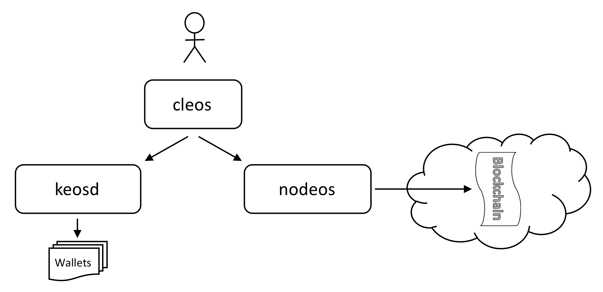

# EOS调研结果

> Author: huziang
>
> Date：2018年5月13日 星期天 下午9:48

## EOS的背景调研：

1. EOS是block.one开发的一款区块链操作系统，和比特币，以太坊的底层实现不同。目前进行到dawn3.0版本。

   block.one官网：https://block.one/

   EOS官网：https://eos.io/

   github地址：https://github.com/EOSIO/eos/

2. EOS上开发的Dapp基本全部属于设计和研发阶段，因此EOS目前的作用仅限于EOS货币。

   下图是EOS上开发的一些Dapp：（基本都没查到相关信息，有些官网都改了）

   

   

3. 抛开EOS不谈，目前以区块链为基础的应用基本都与货币有关。

   一种是生成货币，然后炒币。例如比特币，以太坊。

   一种是生成货币，然后通过生成的虚拟货币（作为奖励）搭建去中心化平台。例如Steem（一个社交平台）。

#### **总结：**

**EOS目前还是一个偏概念性的东西，虽然已经有编程实现，但是没人在上面开发出像模像样的成品。目前EOS的作用仅限于炒币。我个人认为EOS未来可能会出现像Steem之类的平台。**

## EOS的原理调研：

> PS: 本章内容大部分来自EOS白皮书。地址：
>
> https://github.com/EOSIO/Documentation/blob/master/TechnicalWhitePaper.md

###底层实现：

EOS.IO借助WASM（WebAssembly，一种字节码技术，可将c/c++代码解释成二进制格式，也可以在json和二进制格式之间无缝转换）虚拟机，规范化了ABI格式，因此可以在不同的操作系统上进行通讯。

EOS.IO使用的数据库类似于mongodb，所有数据都被解析成json格式，然后通过WASM转换成二进制格式存储到数据库中。

**和比特币，以太坊类似，EOS.IO基于石墨烯底层，实现高频交易。项目地址：https://github.com/cryptonomex/graphene**

###区块（block）：

**PS：我个人认为的EOS.IO亮点之一**

EOS.IO精确到0.5s生成一个块，同比特币一样，该块中记录了本时间段内交易的记录和上一个块的hash值。与比特币不同的是，新块中的hash值不做要求，新块的hash值不再需要满足类似0000000xxxxxxxxxx这种形式。

EOS.IO与比特币不同，EOS.IO通过BFT（拜占庭容错机制）和DPOS（股份授权证明机制）生成新区块，具体细节如下：

- **DPOS：股份授权证明机制**


> 简单来说，DPOS就是按股份管理公司制度，股东根据持股数投票选出董事会，董事会管理公司。

在EOS.IO中：

进行交易的货币被称为令牌（token），持有令牌的用户被称为股东。

每个股东根据自己持有的令牌数量，1:1获得选票，所有股东都可以自由投票给任意节点。最终，得票最多的21个节点成为区块生产者（见证人）。

由这21个区块生产者，相互协作，按照一定的顺序，轮流进行记账。**出块间隔为3s一个的大区块**。此外，这21个区块生产者，不仅记账，还需要提供EOS全链所需要的计算和网络资源（包括CPU、内存、存储容量等等）。

如果某个节点出现故障，之后节点会跟上继续计块。

如果在过程中出现了分叉，DPOS仍然采用的是最长链原则，并且约定每个节点不能同时在两个链上出块（否则节点将被判定为违规，且失去资格），这使得当产生分叉之后，最多过一半见证人节点总数的高度之后（在EOS里是11个区块高度），就只会保留一条链了。

区块生产者进行一轮后（生产完21个大区块），股东将根据之前表现重新选择生产者，以此循环。

- **BFT：拜占庭容错机制**


> 简单来说，BFT就是少数服从多数原则，所有节点共同执行多数人听到的命令。

为了提高块确认的速度，EOS.IO又将大区块分解成**出块间隔0.5s一个的小区块**。小区块间不改变生产者。

区块生产者每生成一个小块之后，就会马上广播给其他区块生产者。其他区块生产者收到广播后，会立即对该区块进行确认，当有2/3的区块生产者（15个）对该区块进行确认后，该区块就会进入**不可逆状态**。加入到区块链中。

### 确定性并行执行：

- **区块分割**

为了最大限度的进行并行执行，减少平均通讯延迟，EOS.IO将：

区块（block）分成多个周期（cycles）。

一个周期分成多个并行执行的碎片（shards）。

一个碎片包含一个事务列表（transactions）。

一个事务列表包含一个或多个动作（actions）。

每发起一个交易，就会生成一个新的事务列表，该事务列表一般都会在一个block之内完成，这样，一个用户向另一个帐户发送操作并接收响应所需的时间就不会超过0.5s。

```
  Block

    Region

      Cycles (sequential)

        Shards (parallel)

          Transactions (sequential)

            Actions (sequential)

              Receiver and Notified Accounts (parallel)
```

- **上下文无关操作**

上下文无关行动涉及仅取决于交易数据的计算，而不取决于区块链状态。例如，签名验证是一种只需要事务数据和签名以确定签署事务的公钥的计算。这是区块链必须执行的最昂贵的单个计算之一，但由于此计算是上下文无关的，因此可以并行执行。

- **只读操作**

某些帐户可能能够以通过/未通过的方式处理动作，而不必修改其内部状态。如果是这种情况，那么这些处理程序可以并行执行。

### 令牌（token）：

令牌是EOS.IO的货币。与比特币一样，生产者生产新区块后，会获得令牌作为奖励。

EOS.IO为了防止资源滥用，通过令牌分配区块链上的资源。通过链接上EOS.IO的区块链，应用程序可以使用三大类资源：

1. 带宽和磁盘
2. CPU
3. RAM

同时，用户的本地的可用资源也会被系统统计计算。

用户根据自身持有的令牌数量，使用区块链上的资源，自身拥有的令牌数量越多，可使用的区块链上的资源也越多。例如：如果一个账户持有根据该区块链可分配总代币的1％，则该账户有可能利用1％的RAM容量。

### 账号（account）：

EOS.IO通过公钥，私钥，ID来创建账号。EOS.IO为每个帐户提供了自己的专用数据库，只能由其自己的操作处理程序访问。其中，公钥，私钥储存在自己专用数据库中，避免泄漏。

- **操作和处理程序**

每个帐户都可以将结构化的操作发送给其他帐户，并可以定义脚本以在收到操作时处理操作。这个结构化的操作由合约（contract）定义。

为了保证并行，用户在数据库中访问账户信息的时候没有冲突。

- **权限管理**

**PS：我个人认为的EOS.IO亮点之二**

在EOS.IO软件，帐户可以定义命名的权限级别，每个级别都可以从更高级别的命名权限中获取。一定或更高级别的权限可以执行对应级别的动作。

- **权限映射**

EOS.IO软件允许每个帐户定义任何其他帐户的合同或动作与其自己的命名权限级别之间的映射。例如：可以将账户alice与账户bob的交易行为映射到账户alice的"Friend"组，这样下次交易就不需要进行权限认证。

- **评估权限（没看太懂）**

假设alice和bob进行交易，交易类型叫做Action，评估先后顺序如下：

1. 查看bob的Action组是否存在权限映射
2. 遍历bob的Action组的父节点寻找是否有alice
3. 如果未找到，遍历alice父节点，重新执行1，2

如下图：


### 合约（contract）：

EOS.IO的合约包含一组操作和类型定义。其中，操作定义指定并实施合约的动作（即Action），类型定义指定了操作所需的内容和结构。

账户和合约之间可以通过动作进行通讯，中间过程类似于CS架构中的client端和server端。

**PS：EOS.IO已经开放了自定义智能合约的api，用户可以生成自己的合约。**

### 自治：

**PS：我个人认为的EOS.IO亮点之三**

自治分为三个步骤：

1. 用户对某个集体的主关问题达成共识。例如：生产者生产新区块获得的令牌过多，应该少一点。
2. 执行集体决定
3. 通过宪法改变规则

- **冻结账户和更改合约代码**

当出现异常用户或者异常程序时，生产者可以通过投票决定是否冻结账户或者替换合约代码。2/3（15个）生产者同意则操作执行。

- **宪法**

宪法的内容规定了用户之间的义务，不能由法典完全执行，并通过确立管辖权和法律选择以及其他相互接受的规则来促进解决争端。在网络上广播的每一笔交易都必须包含宪章的散列作为签名的一部分，从而明确约定签署人与合同。

宪法是用户建立合约和交易时绑定签署的部分条约，所有用户都必须要遵守宪法。

宪法修改过程如下：

1. 区块生产者提议修改宪法，并获得2/3（15个）生产者批准。
2. 2/3（15个）生产者连续30天支持新宪法。
3. 所有用户都必须表明接受新宪法，作为未来交易的前提条件。
4. 区块生产者通过修改源代码来反映宪法的变化，并使用新宪法的散列将其提交给区块链。
5. 2/3（15个）生产者连续30天支持新代码。
6. 对代码的更改在7天后生效，在批准源代码后给予所有非生产节点1周的时间进行升级。
7. 所有不升级到新代码的节点都会自动关闭

#### **总结：**

**EOS.IO构建的系统类似于互联网，添加合约类似于在互联网上添加服务端，添加账户类似于在互联网上添加客户端节点。**

**个人认为EOS.IO的优点和特点：**

1. **支持高频并发交易**
2. **完善的账户权限系统**
3. **拥有交易不可抵赖性**
4. **可以分配整个区块链的资源**
5. **高度自治**
6. **去中心化**

**虽然EOS.IO可以在多个计算机之间搭建统一平台，但是我还未找到对应的安装教程和资料，可能还未实现。**

## EOS的程序实现：

> PS：本章内容大部分来自于EOSwiki，地址：
>
> https://github.com/EOSIO/eos/wiki

**PS：官网上的EOS.IO项目目前还是私有链测试版。**

EOS.IO程序分成三个部分，如图所示：



- nodeos：服务端。建立在本机的私有区块链，接口为Restful模式，运行后每0.5s生成一个块。通过nodeos可以进行账户和合约操作。
- cleos：客户端。用户输入指令访问keosd和nodeos进程，执行命令。
- keosd：管理wallet的守护进程，wallet包含私钥和公钥，储存在本地保证安全。

钱包，密钥，账户，合约的关系如下：

- 钱包：储存在本地数据库，一个钱包可包含多个密钥对，只有钱包打开后，用该钱包中密钥创建的账户才能进行交易。
- 密钥：可生成任意个，生成后可放入钱包内，用于账户创建的时候设置Owner和Active权限。
- 账户：由钱包中的公钥创建，一个钱包可以创建多个账户，账户可以通过合约与其他用户进行交易。账户是进行操作的基本单位。
- 合约：类似于服务端，运行在区块链上。账户可以通过合约指定的Action接口与合约进行交互。账户和合约类似于CS架构。


## EOS的程序部署：

> PS：本章内容大部分来自于EOSwiki，地址：
>
> https://github.com/EOSIO/eos/wiki/Local-Environment

**配置环境：macOS High Sierra 10.13.4**

#### 安装编译源程序：

- 从github上下载指定版本，本次下载dawn-v3.0.0版本，如果需要其他下载版本可以去github查看。

~~~bash
$ git clone https://github.com/EOSIO/eos.git --recursive
~~~

必须要添加—recersive，整个时间较长。

- 进入目录文件夹，运行脚本自动安装依赖环境。

~~~bash
$ cd eos
$ ./eosio_build.sh
~~~

EOS依赖环境如下，如果brew运行不了，可以自行安装：

1. make
2. cmake
3. boost
4. openssl
5. secp256k1-zkp
6. wasm （**PS：一定要4.0.0版本**）

- 进入build文件夹，进行编译。

~~~ bash
$ mkdir build && cd build
$ cmake -DBINARYEN_BIN=~/binaryen/bin -DWASM_ROOT=~/wasm-compiler/llvm -DOPENSSL_ROOT_DIR=/usr/local/opt/openssl -DOPENSSL_LIBRARIES=/usr/local/opt/openssl/lib ..
$ make -j4
~~~

编译过程较长，可能需要近一个小时。

- （可选）如果想选择安装程序包，直接make install即可。

~~~bash
$ make install
~~~

#### 运行nodeos节点：

- 修改config.ini文件

~~~bash
$ vim ~/Library/Application\ Support/eosio/nodeos/config/config.ini
~~~

添加或修改一下信息：

~~~bash
# Load the testnet genesis state, which creates some initial block producers with the default key
genesis-json =  "~/Library/Application Support/eosio/nodeos/config/genesis.json"
# Enable production on a stale chain, since a single-node test chain is pretty much always stale
enable-stale-production = true
# Enable block production with the testnet producers
producer-name = eosio
# Load the block producer plugin, so you can produce blocks
plugin = eosio::producer_plugin
# Wallet plugin
plugin = eosio::wallet_api_plugin
# As well as API and HTTP plugins
plugin = eosio::chain_api_plugin
plugin = eosio::http_plugin
~~~

（PS：eos的nodeos信息存放在~/Library/Application Support/eosio/nodeos/文件夹下）

- 修改完毕配置信息后，即可运行（前提将mongodb数据库开启）

~~~
$ cd /path/eos/build/programs/nodeos
$ ./nodeos
~~~

- 如输出以下信息，则运行成功。

~~~bash
2056511ms thread-0   producer_plugin.cpp:239       block_production_loo ] eosio generated block bcdc4795... #208537 @ 2018-05-15T06:34:16.500 with 0 trxs, lib: 208536
2057011ms thread-0   producer_plugin.cpp:239       block_production_loo ] eosio generated block 7d512d05... #208538 @ 2018-05-15T06:34:17.000 with 0 trxs, lib: 208537
2057510ms thread-0   producer_plugin.cpp:239       block_production_loo ] eosio generated block c795360e... #208539 @ 2018-05-15T06:34:17.500 with 0 trxs, lib: 208538
2058011ms thread-0   producer_plugin.cpp:239       block_production_loo ] eosio generated block be4026cd... #208540 @ 2018-05-15T06:34:18.000 with 0 trxs, lib: 208539
2058513ms thread-0   producer_plugin.cpp:239       block_production_loo ] eosio generated block bbfa3c34... #208541 @ 2018-05-15T06:34:18.500 with 0 trxs, lib: 208540
~~~

PS：整个安装过程需要时间较长。

## EOS的合约构建和常见API使用：

> PS：本章tic.tac.toe合约见github。
>
> https://github.com/EOSIO/eos/wiki/Tutorial-Tic-Tac-Toe
>
> PS：合约源码在eos/contract/tic_tac_toe也能找到。

- 创建新钱包mywallet：

~~~bash
$ cleos wallet create -n mywallet
Creating wallet: mywallet
Save password to use in the future to unlock this wallet.
Without password imported keys will not be retrievable.
"PW5HzsvBkDc3BWHwPydDfa9YEzeneHCCcTvLUUYUaxMSxXnMJWbtJ"
~~~

会生成对应钱包的密钥，请记住。

- 输入刚刚的密码，解锁钱包mywallet：

~~~bash
$ cleos wallet unlock -n mywallet
password: Unlocked: mywallet
~~~

- 生成一对密钥：

~~~bash
$ cleos create key
Private key: 5J425KHYu4XN6sxWxNRA83hCVEiWJ22HHLiQjq7sXpVYNS3Sdjb
Public key: EOS6GxfQNPKs13U3aXubDmEXocqjnWaNhksSojVw2Q9UWknvpqBi2
~~~

- 将密钥加入钱包mywallet：

~~~bash
$ cleos wallet import 5J425KHYu4XN6sxWxNRA83hCVEiWJ22HHLiQjq7sXpVYNS3Sdjb -n mywallet
imported private key for: EOS6GxfQNPKs13U3aXubDmEXocqjnWaNhksSojVw2Q9UWknvpqBi2
~~~

- 根据刚刚的密钥创建两个账户，alice和bob：

~~~bash
$ cleos create account eosio alice EOS6GxfQNPKs13U3aXubDmEXocqjnWaNhksSojVw2Q9UWknvpqBi2 EOS6GxfQNPKs13U3aXubDmEXocqjnWaNhksSojVw2Q9UWknvpqBi2
executed transaction: 00af7518e9cfcdd3e6781a63faf5df1c4a9d6a8858510fdfed310e286e105d2b  352 bytes  102400 cycles
#         eosio <= eosio::newaccount            {"creator":"eosio","name":"alice","owner":{"threshold":1,"keys":[{"key":"EOS6GxfQNPKs13U3aXubDmEXocq...
$ cleos create account eosio bob EOS6GxfQNPKs13U3aXubDmEXocqjnWaNhksSojVw2Q9UWknvpqBi2 EOS6GxfQNPKs13U3aXubDmEXocqjnWaNhksSojVw2Q9UWknvpqBi2
executed transaction: 918122fe176eb2cd3785f6886500c77cfafbb1da0e546678175c203b128fdd71  352 bytes  102400 cycles
#         eosio <= eosio::newaccount            {"creator":"eosio","name":"bob","owner":{"threshold":1,"keys":[{"key":"EOS6GxfQNPKs13U3aXubDmEXocqjn...
~~~

eosio是系统默认的账户。我们使用刚刚创建的公钥创建账户。

其中"eosio <= eosio::newaccount"即代表执行了一个事务，该事物由一个action组成。

- 创建合约tic.tac.toc，由于eos给定的合约缺少.wast文件，我们先编译，再创建合约。

~~~bash
$ cd /path/eos/contracts/
$ eosiocpp -o tic_tac_toe/tic_tac_toe.wast tic_tac_toe/tic_tac_toe.cpp 
$ cleos set contract tic.tac.toe tic_tac_toe/
Reading WAST/WASM from tic_tac_toe/tic_tac_toe.wast...
Assembling WASM...
Publishing contract...
executed transaction: 98499896fa16bad6d7adb55de2cf2e1296deaccde6b466b7ed3141b87878933e  4848 bytes  2200576 cycles
#         eosio <= eosio::setcode               {"account":"tic.tac.toe","vmtype":0,"vmversion":0,"code":"0061736d01000000016a1260000060027e7e006001...
#         eosio <= eosio::setabi                {"account":"tic.tac.toe","abi":{"types":[],"structs":[{"name":"game","base":"","fields":[{"name":"ch...
~~~

- alice账户创建新棋局（执行create Action）：

~~~bash
$ cleos push action tic.tac.toe create '{"challenger":"bob", "host":"alice"}' -p alice@active
executed transaction: 4e10c6a8f257681ff64ca0937f83833a68e5e976d4edbdb507882467fdef5ab6  240 bytes  104448 cycles
#   tic.tac.toe <= tic.tac.toe::create          {"challenger":"bob","host":"alice"}
~~~

其中-p意思是给定此Action的权限。

- alice和bob各走一步（执行move Action）：

~~~bash
$ cleos push action tic.tac.toe move '{"challenger":"bob", "host":"alice", "by":"alice", "mvt":{"row":0, "column":0} }' -p alice@active
executed transaction: 12711be167e84b1c3eb191c2c170c2c68dd0feed039767a1abb5cc45656808c9  256 bytes  107520 cycles
#   tic.tac.toe <= tic.tac.toe::move            {"challenger":"bob","host":"alice","by":"alice","mvt":{"row":0,"column":0}}
$ cleos push action tic.tac.toe move '{"challenger":"bob", "host":"alice", "by":"bob", "mvt":{"row":1, "column":1} }' -p bob@active
executed transaction: 0b6c28e9d3ecbea4077f78a20db1225ea798afadb15c4baca9954338c25fc94a  256 bytes  107520 cycles
#   tic.tac.toe <= tic.tac.toe::move            {"challenger":"bob","host":"alice","by":"bob","mvt":{"row":1,"column":1}}
~~~

- 棋局情况：

~~~bash
$ cleos get table tic.tac.toe alice games
{
  "rows": [{
      "challenger": "bob",
      "host": "alice",
      "turn": "alice",
      "winner": "none",
      "board": [
        1,
        0,
        0,
        0,
        2,
        0,
        0,
        0,
        0
      ]
    }
  ],
  "more": false
}
~~~

- alice关闭棋局（执行move Action）：

~~~bash
$ cleos push action tic.tac.toe close '{"challenger":"bob", "host":"alice"}' -p alice@active
executed transaction: 74b592bb33f6bc9e7c23800dc2fd607969ba74f7ba1de43ef0794a4607842207  240 bytes  105472 cycles
#   tic.tac.toe <= tic.tac.toe::close           {"challenger":"bob","host":"alice"}
$ cleos get table tic.tac.toe alice games
{
  "rows": [],
  "more": false
}
~~~

## 目前进展：

1. 已经了解了EOS的基本原理构造和运作方式
2. 成功的在本地部署了了EOS.IO程序
3. 可以较为熟练的使用cleos中的api
4. 已经开发出了教程中的tic.tac.toe合约，并且成功运行

## 存在的问题：

1. 目标需求不明确：目前我有两个进一步研究的方向。
   - 研究EOS具体底层实现方式。例如：研究石墨烯项目，了解高频并发如何做到。这一点可能对公司有些贡献。
   - 进行EOS合约开发。例如：开发xiaozong之前说的工资系统，实现每个月发工资。
2. EOS很多具体细节，例如如何进行节点间通讯，怎么实现DPOS，我到现在还是没有搞懂，可能需要进一步研究。