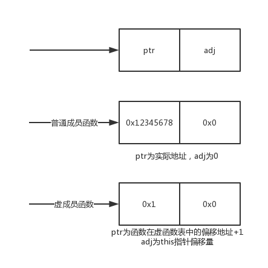
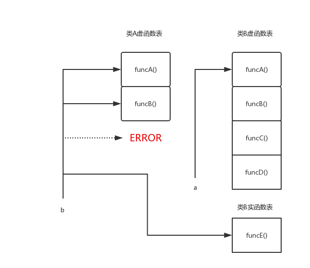

# C语言中类和虚类有关问题

> Author: huziang  
> Date: 18-4-4

## 类中虚函数和非虚函数的区别

- 虚函数看指针指向的实例的实际类型
- 非虚函数看指针类型

例子：

~~~c++
// test.cpp
#include <iostream>
using namespace std;

class A {
    char a;
public:
    A() {
        a = 'a';
    }
    virtual void vir() {
        cout << a << " virtual function!" << endl;
    }

    void act() {
        cout << a << " actual function!" << endl;
    }
};

class B : public A {
    char b;
public:
    B() : A() {
        b = 'b';
    }
    virtual void vir() {
        cout << b << " virtual function!" << endl;
    }

    void act() {
        cout << b << " actual function!" << endl;
    }
};

int main() {
    A a;
    B *b = (B*)&a;
    b->vir();
    b->act(); 
}
~~~

结果：

~~~bash
$ ./test1
a virtual function!
� actual function!
~~~

由此可知，当子类指针指向父类对象时，子类的非虚函数能够使用，但是子类的特别变量不能访问（访问乱码）。

## 类中的成员函数

> 参考链接：http://www.cnblogs.com/malecrab/p/5572119.html

对于普通指针变量来说，其值是它所指向的地址，0表示空指针。
而对于数据成员指针变量来说，其值是数据成员所在地址相对于对象起始地址的偏移值，空指针用-1表示。

例子：

~~~c++
#include <iostream>
using namespace std;

struct X {
    int a;
    short b;
    int c;
};
#define VALUE_OF_PTR(p)     (*(long*)&p)

int main() {
    int X::*p = 0;  // VALUE_OF_PTR(p) == -1
    cout << VALUE_OF_PTR(p) << endl;
    p = &X::a;      // VALUE_OF_PTR(p) == 0
    cout << VALUE_OF_PTR(p) << endl;
    short X::*d = &X::b;      // VALUE_OF_PTR(p) == 4
    cout << VALUE_OF_PTR(d) << endl;
    p = &X::c;
    cout << VALUE_OF_PTR(p) << endl;
    return 0;
}
~~~

结果：

~~~c++
$ ./test2
-1
0
4
8
~~~

由此可知，数据成员指针变量为空时，指针值为-1，其他成员的值是相对于起始地址的偏移值。

**！！！存在内存补全**

## 类成员函数指针为什么会是16个字节（2*指针长度）

类成员的函数指针长度为16个字节，是普通指针长度的两倍，这是由于虚函数指针的实现方式决定的。

如下图：

其中：

- ptr：如果是普通成员函数，ptr是实际的函数地址。

  ​	如果是虚成员函数，ptr是函数在虚函数表中的偏移地址+1。

- adj：如果是普通成员函数，adj为0。

  ​	如果是虚成员函数，adj为该类距离起始位置的偏移量。

例子：

~~~c++
#include <iostream>
using namespace std;

extern "C" int printf(const char*, ...);

struct A {
    char t1[20];
    virtual void foo() { printf("A::foo(): this = 0x%p\n", this); }
};
struct B {
    char t2[20];
    virtual void bar() { printf("B::bar(): this = 0x%p\n", this); }
};
struct C : public A, public B {
    char t3[20];
    virtual void quz() { printf("C::quz(): this = 0x%p\n", this); }
    void act() { cout << "C's this is :" << this << endl; }
};

void (A::*pafoo)() = &A::foo;   // ptr: 1, adj: 0
void (B::*pbbar)() = &B::bar;   // ptr: 1, adj: 0
void (C::*pcfoo)() = &C::foo;   // ptr: 1, adj: 0
void (C::*pcbar)() = &C::bar;   // ptr: 1, adj: 8
void (C::*pcquz)() = &C::quz;   // ptr: 9, adj: 0
void (C::*pcact)() = &C::act;   

#define PART1_OF_PTR(p)     (((long*)&p)[0])
#define PART2_OF_PTR(p)     (((long*)&p)[1])

int main() {
    A a;
    C *c = (C*)&a;

    cout << "A's size: " << sizeof(A) << endl;
    cout << "B's size: " << sizeof(B) << endl;
    cout << "C's size: " << sizeof(C) << endl;
    printf("&A::foo->ptr: 0x%lX, ", PART1_OF_PTR(pafoo));   // 1
    printf("&A::foo->adj: 0x%lX\n", PART2_OF_PTR(pafoo));   // 0
    printf("&B::bar->ptr: 0x%lX, ", PART1_OF_PTR(pbbar));   // 1
    printf("&B::bar->adj: 0x%lX\n", PART2_OF_PTR(pbbar));   // 0
    printf("&C::foo->ptr: 0x%lX, ", PART1_OF_PTR(pcfoo));   // 1
    printf("&C::foo->adj: 0x%lX\n", PART2_OF_PTR(pcfoo));   // 0
    printf("&C::bar->ptr: 0x%lX, ", PART1_OF_PTR(pcbar));   // 1
    printf("&C::bar->adj: 0x%lX\n", PART2_OF_PTR(pcbar));   // 8
    printf("&C::quz->ptr: 0x%lX, ", PART1_OF_PTR(pcquz));   // 9
    printf("&C::quz->adj: 0x%lX\n", PART2_OF_PTR(pcquz));   // 0
    
    cout << endl;
    printf("&C::act->ptr: 0x%lX, ", PART1_OF_PTR(pcact));
    printf("&C::act->adj: 0x%lX\n", PART2_OF_PTR(pcact));

    return 0;
}
~~~

结果：

~~~bash
$ ./test5
A's size: 32
B's size: 32
C's size: 80
&A::foo->ptr: 0x1, &A::foo->adj: 0x0
&B::bar->ptr: 0x1, &B::bar->adj: 0x0
&C::foo->ptr: 0x1, &C::foo->adj: 0x0
&C::bar->ptr: 0x1, &C::bar->adj: 0x20
&C::quz->ptr: 0x9, &C::quz->adj: 0x0

&C::act->ptr: 0x10E01AB50, &C::act->adj: 0x0
~~~

## 类中多态实现方式

c++中，对于每一个类，只维护了一个虚函数表，通过修改虚函数指针，达成指向不同虚函数表的方式。

**因此，当一个子类指针指向父类对象的时候，该指针不能调用自己类的虚函数，但可以调用自己类的非虚函数。**

例子：

~~~c++
#include <iostream>
using namespace std;

#define PART1_OF_PTR(p)     (((long*)&p)[0])
#define PART2_OF_PTR(p)     (((long*)&p)[1])

class A {
public:
    virtual void funcA() { cout << "A funcA\n"; }
    virtual void funcB() { cout << "A funcB\n"; }
};

class B : public A {
public:
    virtual void funcC() { cout << "B funcC\n"; }
    virtual void funcD() { cout << "B funcD\n"; }
    void funcA() { cout << "B funcA\n"; }
    void funcB() { cout << "B funcB\n"; }
    void funcE() { cout << "B funcE\n"; }
};

int main() {
    A *a = (A*)(new B());
    B *b = (B*)(new A());
    b->funcA();
    b->funcB();
    b->funcE();
    b->funcC();
}
~~~

结果：

~~~bash
$ ./test2
A funcA
A funcB
B funcE
Bus error: 10
~~~

原因如下图：

