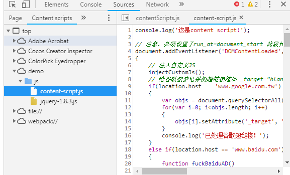
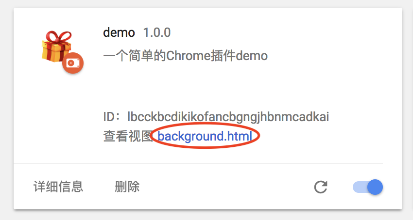
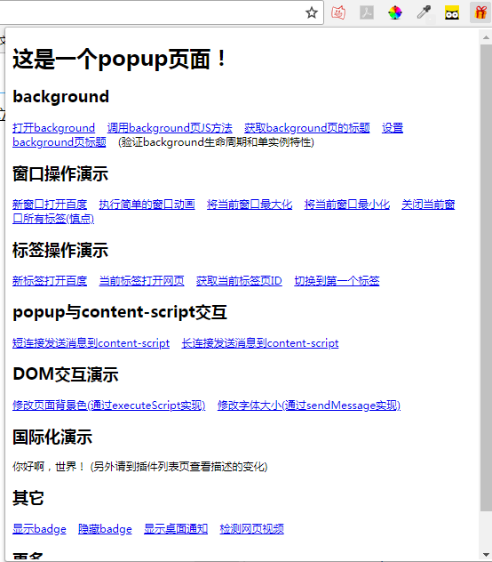
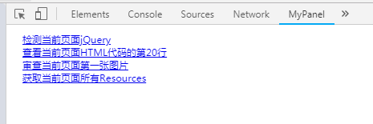

# chrome插件开发

> Author: huzi(moustache) 
> Date: 18-7-25 22:24

## 前言

本文参考于：

 - http://www.lupaworld.com/article-228139-1.html
 - https://blog.csdn.net/qustdong/article/details/46046553
 - https://www.cnblogs.com/liuxianan/p/chrome-plugin-develop.html
 - http://www.cnblogs.com/guogangj/p/3235703.html#t6

使用Demo来源如下：
 
 - https://github.com/sxei/chrome-plugin-demo/tree/master/demo

## Demo介绍

Demo的文件夹结构如下：

~~~bash
.
├── _locales
│   ├── en
│   │   └── messages.json
│   └── zh_CN
│       └── messages.json
├── background.html
├── css
│   └── custom.css
├── devtools.html
├── img
│   ├── icon.png
│   └── sds.png
├── js
│   ├── background.js
│   ├── content-script.js
│   ├── devtools.js
│   ├── inject.js
│   ├── jquery-1.8.3.js
│   ├── mypanel.js
│   ├── options.js
│   ├── popup.js
│   └── show-image-content-size.js
├── manifest.json
├── mypanel.html
├── newtab.html
├── options.html
├── popup.html
└── sidebar.html
~~~

 - _locales：用于适配不同语言的chrome，一般用不到。
 - manifest.json：这个文件是核心入口文件，其他文件都是由这个文件为基础。
 - css/img/js：存放资源，脚本。
 - 其他html：manifest.json中的扩展。
 
 总结：chrome开发没有严格的项目结构要求，只需要本目录有manifest.json即可。

## chrome插件开发核心

想要开发chrome插件，需要了解三点：

 1. manifest.json
 2. chrome插件的各类脚本
 3. 各类脚本之间的消息通讯

## 1. manifest.json

这是chrome插件的配置文件，里面有所有相关插件的配置属性，其中，**manifest_version**、**name**、**version**必须。
文件如下：

~~~json
{
	// 清单文件的版本，这个必须写，而且必须是2
	"manifest_version": 2,
	// 插件的名称
	"name": "demo",
	// 插件的版本
	"version": "1.0.0",
	// 插件描述
	"description": "__MSG_pluginDesc__",
	// 图标，一般偷懒全部用一个尺寸的也没问题
	"icons":
	{
		"16": "img/icon.png",
		"48": "img/icon.png",
		"128": "img/icon.png"
	},
	// 会一直常驻的后台JS或后台页面
	"background":
	{
		// 2种指定方式，如果指定JS，那么会自动生成一个背景页
		"page": "background.html"
		//"scripts": ["js/background.js"]
	},
	// 浏览器右上角图标设置，browser_action、page_action、app必须三选一
	"browser_action": 
	{
		"default_icon": "img/icon.png",
		// 图标悬停时的标题，可选
		"default_title": "这是一个示例Chrome插件",
		"default_popup": "popup.html"
	},
	// 当某些特定页面打开才显示的图标
	/*"page_action":
	{
		"default_icon": "img/icon.png",
		"default_title": "我是pageAction",
		"default_popup": "popup.html"
	},*/
	// 需要直接注入页面的JS
	"content_scripts": 
	[
		{
            // 匹配地址的规则
			// "<all_urls>" 表示匹配所有地址
			"matches": ["<all_urls>"],
			// 多个JS按顺序注入
			"js": ["js/jquery-1.8.3.js", "js/content-script.js"],
			// JS的注入可以随便一点，但是CSS的注意就要千万小心了，因为一不小心就可能影响全局样式
			"css": ["css/custom.css"],
			// 代码注入的时间，可选值： "document_start", "document_end", or "document_idle"，最后一个表示页面空闲时，默认document_idle
			"run_at": "document_start"
		},
		// 这里仅仅是为了演示content-script可以配置多个规则
		{
			"matches": ["*://*/*.png", "*://*/*.jpg", "*://*/*.gif", "*://*/*.bmp"],
			"js": ["js/show-image-content-size.js"]
		}
	],
	// 权限申请
	"permissions":
	[
        // 以下是chrome插件，申请后可以通过chrome.contextMenus.XXXX使用其功能
		"contextMenus", // 右键菜单
		"tabs", // 标签
		"notifications", // 通知
		"webRequest", // web请求
		"webRequestBlocking", // 阻塞式web请求
		"storage", // 插件本地存储

        // 以下是注入脚本能访问的网站
		"http://*/*", // 可以通过executeScript或者insertCSS访问的网站
		"https://*/*" // 可以通过executeScript或者insertCSS访问的网站
	],
	// 普通页面能够直接访问的插件资源列表，如果不设置是无法直接访问的
	"web_accessible_resources": ["js/inject.js"],
	// 插件主页，这个很重要，不要浪费了这个免费广告位
	"homepage_url": "https://www.baidu.com",
	// 覆盖浏览器默认页面
	"chrome_url_overrides":
	{
		// 覆盖浏览器默认的新标签页
		"newtab": "newtab.html"
	},
	// Chrome40以前的插件配置页写法
	"options_page": "options.html",
	// Chrome40以后的插件配置页写法，如果2个都写，新版Chrome只认后面这一个
	"options_ui":
	{
		"page": "options.html",
		// 添加一些默认的样式，推荐使用
		"chrome_style": true
	},
	// 向地址栏注册一个关键字以提供搜索建议，只能设置一个关键字，不重要
	"omnibox": { "keyword" : "go" },
	// 默认语言
	"default_locale": "zh_CN",
	// devtools页面（即开发工具栏）入口，注意只能指向一个HTML文件，不能是JS文件
	"devtools_page": "devtools.html"
}
~~~

## 2. chrome插件的各类脚本

### 2.1 原页面

chrome插件通过context-scripts和injected-script修改原页面。

 - context-scripts

chrome插件向原页面注入的脚本的一种形式。可以向指定页面注入JS和CSS文件。

特点：**不属于chrome开发插件脚本，不能访问绝大多数chrome.xxx.api**。和原页面共享DOM，但不共享JS。

调试：通过content script控件调试。

示例：

~~~json
{
	"content_scripts": 
	[
		{
			// 匹配地址的规则
			// "<all_urls>" 表示匹配所有地址
			"matches": ["<all_urls>"],
			// 多个JS按顺序注入
			"js": ["js/jquery-1.8.3.js", "js/content-script.js"],
			// JS的注入可以随便一点，但是CSS的注意就要千万小心了，因为一不小心就可能影响全局样式
			"css": ["css/custom.css"],
			// 代码注入的时间，可选值： "document_start", "document_end", or "document_idle"，最后一个表示页面空闲时，默认document_idle
			"run_at": "document_start"
		}
	]
}
~~~

对所有地址的页面，chrome插件都会在该页面开始加载前，按顺序注入"js/jquery-1.8.3.js"，"js/content-script.js"和"css/custom.css"三个文件。可以通过这三个文件修改原页面。

 - injested-script

injested-script指通过DOM操作像页面注入的一种JS。由于context-script无法访问页面的JS，因此如果想访问页面的JS（例如访问变量或函数），或者动态注入JS，就需要使用这种方式。

特点：**不属于chrome开发插件脚本，不能访问绝大多数chrome.xxx.api**。和原页面共享DOM和JS。

调试：和原页面一起调试。

示例：

~~~js
// 向页面注入JS
function injectCustomJs(jsPath)
{
	jsPath = jsPath || 'js/inject.js';
	var temp = document.createElement('script');
	temp.setAttribute('type', 'text/javascript');
	// 获得的地址类似：chrome-extension://ihcokhadfjfchaeagdoclpnjdiokfakg/js/inject.js
	temp.src = chrome.extension.getURL(jsPath);
	temp.onload = function()
	{
		// 放在页面不好看，执行完后移除掉
		this.parentNode.removeChild(this);
	};
	document.body.appendChild(temp);
}

// 调用页面中window.getNodeInfo函数（仅限devtools）
function triggerFunc() {
	let code = "window.getNodeInfo('" + uuid + "')";
	chrome.devtools.inspectedWindow.eval(code);
}
~~~

PS：为了使用该脚本，manifest.json中需要把该脚本加入资源列表。

~~~json
{
	// 普通页面能够直接访问的插件资源列表，如果不设置是无法直接访问的
	"web_accessible_resources": ["js/inject.js"]
}
~~~

### 2.2 background

常驻在后台的脚本，它随着浏览器的打开而打开，随着浏览器的关闭而关闭。一般用于资源初始化，全局变量设置。

特点：**完全属于chrome开发插件脚本，可以访问绝大多数chrome.xxx.api（devtools除外）**。生命周期长，和原页面没有直接关系。可以跨域。

调试：如图。该页面的html只能通过url显示。

示例：

~~~json
{
	// 会一直常驻的后台JS或后台页面
	"background":
	{
		// 2种指定方式，如果指定JS，那么会自动生成一个背景页
		"page": "background.html"
		//"scripts": ["js/background.js"]
	}
}
~~~

### 2.3 popup

点击小图标弹开的页面，如图所示。它随着单击图标加载，离开焦点就关闭，因此生命周期一般很短。

特点：**完全属于chrome开发插件脚本，可以访问绝大多数chrome.xxx.api（devtools除外），通过chrome.extension.getBackgroundPage()获得background的window对象**。生命周期短，和原页面没有直接关系。可以跨域。

调试：popup界面右键->检查。

示例：

~~~json
{
	// 浏览器右上角图标设置，browser_action、page_action、app必须三选一
	"browser_action": 
	{
		"default_icon": "img/icon.png",
		// 图标悬停时的标题，可选
		"default_title": "这是一个示例Chrome插件",
		"default_popup": "popup.html"
	}
}
~~~

### 2.4 devtools（开发者工具）

在开发者页面的扩展，可以自定义新的页面，如图。

特点：**部分属于chrome开发插件脚本，只能访问chrome.devtools和一小部分api，但是可以通过chrome.devtools.inspectedWindow获得原页面**。可以访问原界面。权限类似于拥有chrome.devtools的context-script。

调试：在新的页面右键->检查。（修改代码后，需要重新加载插件，然后关闭，打开插件）

示例：

manifest.json
~~~json

{
	// devtools页面入口，注意只能指向一个HTML文件，不能是JS文件
	"devtools_page": "devtools.html"
}
~~~

devtools.html
~~~html
<!DOCTYPE html>
<html>
<head></head>
<body>
	
</body>
</html>
~~~

js/devtools.js
~~~js
// 创建自定义面板，同一个插件可以创建多个自定义面板
// 几个参数依次为：panel标题、图标（其实设置了也没地方显示）、要加载的页面、加载成功后的回调
chrome.devtools.panels.create('MyPanel', 'img/icon.png', 'mypanel.html', function(panel)
{
	console.log('自定义面板创建成功！'); // 注意这个log一般看不到
});

// 创建自定义侧边栏
chrome.devtools.panels.elements.createSidebarPane("Images", function(sidebar)
{
	// sidebar.setPage('../sidebar.html'); // 指定加载某个页面
	sidebar.setExpression('document.querySelectorAll("img")', 'All Images'); // 通过表达式来指定
	//sidebar.setObject({aaa: 111, bbb: 'Hello World!'}); // 直接设置显示某个对象
});
~~~

实际上，新的MyPanel页面加载的是mypanel.html。

### 总结：

 - 脚本权限对比：

| JS种类          | 可访问的API                                    | DOM访问情况  | JS访问情况 | 直接跨域 |
| --------------- | ---------------------------------------------- | ------------ | ---------- | -------- |
| injected script | 和普通JS无任何差别，不能访问任何扩展API        | 可以访问     | 可以访问   | 不可以   |
| content script  | 只能访问 extension、runtime等部分API           | 可以访问     | 不可以     | 不可以   |
| popup js        | 可访问绝大部分API，除了devtools系列            | 不可直接访问 | 不可以     | 可以     |
| background js   | 可访问绝大部分API，除了devtools系列            | 不可直接访问 | 不可以     | 可以     |
| devtools js     | 只能访问 devtools、extension、runtime等部分API | 可以         | 可以       | 不可以   |

这四类脚本可以分为两大类：
 - 属于chrome开发插件脚本：可以使用大部分chrome.api，但是不能访问原页面的background，popup，devtools（比较特殊）。
 - 不属于chrome开发插件脚本：只能使用少部分chrome.api，但是可以访问原页面的context-script，injested-script。
 
chrome各种脚本已经介绍完毕，接下来一个部分，将介绍脚本间的通讯。

## 3. 各类脚本之间的消息通讯

四类脚本中的某些部分可以通过api或者DOM树直接调用，本章只讲需要间接调用的部分。

### 3.1 原脚本间（content-script和injested-script）通讯

通过window.postMessage通讯，可双向通讯。示例：

content-script
~~~js
// 添加监听器
window.addEventListener("message", function(e)
{
	console.log('收到消息：', e.data);
	if(e.data && e.data.cmd == 'invoke') {
		eval('('+e.data.code+')');
	}
	else if(e.data && e.data.cmd == 'message') {
		tip(e.data.data);
	}
}, false);
~~~

injested-script
~~~js
// 通过postMessage调用content-script
function invokeContentScript(code)
{
	window.postMessage({cmd: 'invoke', code: code}, '*');
}
// 发送普通消息到content-script
function sendMessageToContentScriptByPostMessage(data)
{
	window.postMessage({cmd: 'message', data: data}, '*');
}
~~~

### 3.2 原脚本（content-script/injested-script）和chrome脚本间（background/popup/devtools）通讯

通过chrome.runtime.sendMessge或者chrome.runtime.connect（长链接）通讯，可双向通讯。示例：

PS：可以使用chrome.tabs，但只能单向（chrome脚本 -> 原脚本）。

content-script
~~~js
// 主动发送消息给后台
// 要演示此功能，请打开控制台主动执行sendMessageToBackground()
function sendMessageToBackground(message) {
	chrome.runtime.sendMessage({greeting: message || '你好，我是content-script呀，我主动发消息给后台！'}, function(response) {
		tip('收到来自后台的回复：' + response);
	});
}
~~~

background
~~~js
// 监听来自content-script的消息
chrome.runtime.onMessage.addListener(function(request, sender, sendResponse)
{
	console.log('收到来自content-script的消息：');
	console.log(request, sender, sendResponse);
	sendResponse('我是后台，我已收到你的消息：' + JSON.stringify(request));
});
~~~

### 3.3 chrome脚本间（background/popup和devtools）通讯

通过chrome.extension.sendMessage或者chrome.extension.connect（长链接）通讯，可双向通讯。示例：

PS：可以使用chrome.runtime.sendMessage，可以双向。

background
~~~js
// 添加端口，连接后输出端口信息
chrome.extension.onConnect.addListener(function (port) {
  console.log("backgroundScripts connect!");
  console.log(port);
});
~~~

devtools
~~~js
// 进行连接
chrome.extension.connect({
    name: btoa("for" + String(chrome.devtools.inspectedWindow.tabId))
});
~~~

### 总结：

 - 通讯方式对比

PS：`-`表示不存在或者无意义，或者待验证，`*`代表直接通讯，`~`代表间接通讯。

PS2：本表中，devtools可以直接访问injected-script，但是反过来不行。

| | injected-script | content-script | popup-js | background-js | devtools |
|:---:|:---:|:---:|:---:|:---:|:---:|
| injected-script | - | ~  (window.postMessage) | - | - | - |
| content-script  | ~  (window.postMessage) | - | ~  (chrome.runtime.sendMessage) | ~  (chrome.runtime.sendMessage) | - |
| popup-js        | - | ~  (chrome.runtime.sendMessage) | - | *  (chrome.extension.getBackgroundPage()) | ~  (chrome.extension.sendMessage) |
| background-js   | - | ~  (chrome.runtime.sendMessage) | *  (chrome.extension.getViews) | - | ~  (chrome.extension.sendMessage) |
| devtools-js     | *  (chrome.devtools. inspectedWindow.eval) | - | ~  (chrome.extension.sendMessage) | ~  (chrome.extension.sendMessage) | - |

四句话总结：

 1. chrome脚本间通讯用chrome.extension
 2. 原脚本间通讯用window
 3. chrome.runtime是共享单车，大家都能用
 4. chrome脚本 -> 原脚本轻而易举（基本都有直接调用方法） 
 	原脚本 -> chrome脚本难如登天（基本只能用间接方法）