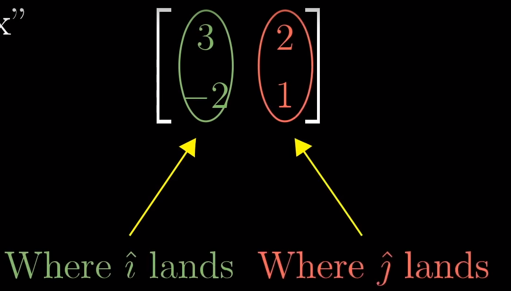
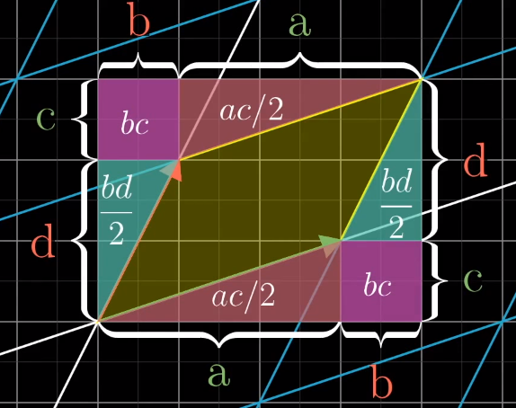

# Essence of linear algebra 观后感

> Author: huzi(moustache) 
>
> Date: 18-9-18 21:13

## Lesson 1

- 在线性代数中，向量起点为零点，指向空间中的某个地方，可以用列表表示。

  线段 <=> 列表

- 在数学家的定义中，定义了向量加法和向量数乘的就是向量。

- 标量：用于缩放向量。因此向量数乘可看成缩放向量。

## Lesson 2

- 向量坐标：将坐标中的每个值看成标量。

  单位向量：i hat和j hat。他们加一起被称作向量的基。

  因此向量可以看成缩放（单位）向量并且相加。

- 两个数乘向量的和被称为这两个向量的线性组合。

- the span of  $ \vec{v} $ and $ \vec{w} $ is the set of  all their linear combinations.

  span可以翻译成空间。

- 当你考虑一个向量时，可以将它看成箭头；当你考虑多个向量时，就把它们都看成点。

- 线性相关：其中一个向量可以表现成之前向量的集合。或者说，新加入这个变量对span毫无帮助。
  $$
  \vec{u} = a \dot{} \vec{v} + b \dot{} \vec{u} \quad 线性相关 \\
  \vec{u} \neq a \dot{} \vec{v} + b \dot{} \vec{u} \quad 线性无关
  $$

## Lesson 3

- 线性变换：变换和函数相同，变换主要是可以可视化输入和输出的关系。“线性”表示一个变换具有以下两条性质：其一，一条直线经过变换后还是一条直线。其二，原点要固定。（可看成保证网格线平行且等距分布）

- 线性变换可以看成i hat和j hat的变换。因此一个二维线性变化只需要四个数字，分别代表变换后的i hat和变换后的j hat。将这四个数字做成矩阵，则矩阵中的两个向量就可以代表变换后的i hat和变换后的j hat。如图所示：

  

- **矩阵乘法可以看成线性变换后的线性组合。**

## Lesson 4

- 复合变换：两个线性变换的复合。这个复合变换的矩阵等于两个线性变换的矩阵的乘积。 
- **可以把矩阵相乘看成两个线性变换的转换。（i hat乘一个矩阵，j hat乘一个矩阵）**

## Lesson 5

- 三维基向量：i hat，j hat，k hat。
- 其他部分和二维差不多。

## Lesson 6

- 变换的行列式(det(M))：任意物体在线性变换前后所组成的面积变换比。可由i hat和j hat组成的单位矩阵变换后的面积得出（初始为1）。

- 特殊情况：

  当det(M) = 0，意味着线性变换后的i hat和j hat是线性相关的（降维）。

  当det(M) < 0：

  ​	二维：意味着线性变换将整个平面翻转了（或者可以说i hat和j hat的相对位置变化了）。

  ​	三维：意味着线性变换将整个空间翻转了，右手定则变成了左手定则（或者可以说i hat和j hat的相对位置变化了）。

- 二维计算方法：
  $$
  det\begin{pmatrix} \begin{bmatrix} a & b \\ c & d \end{bmatrix} \end{pmatrix}
  = (a + b)(c + d) - ac - bd - 2bc = ad - bc
  $$
  见图：

  

- 三维计算方法：
  $$
  det\begin{pmatrix} \begin{bmatrix} a & b & c \\ d & e & f \\ g & h & i \end{bmatrix} \end{pmatrix}
  = a \ det\begin{pmatrix} \begin{bmatrix} e & f \\ h & i \end{bmatrix} \end{pmatrix}
  - b \ det\begin{pmatrix} \begin{bmatrix} d & f \\ g & i \end{bmatrix} \end{pmatrix}、
  + c \ det\begin{pmatrix} \begin{bmatrix} d & e \\ g & h \end{bmatrix} \end{pmatrix}
  $$

## Lesson 7

- 逆矩阵：逆向线性变换，有专门的公式。

- 矩阵的列空间：矩阵的列组成的空间，实际上就是矩阵代表的线性变换所组成的空间。

- 矩阵的秩（rank）：线性变换后的空间维数。（<=变换前空间的维数/矩阵的列数）

  满秩（full rank）：线性变换前后的空间维数不变。

- 零空间：所有经过变换后变成原点的点组成的空间。

## Lesson 8

- 向量乘一个非标准矩阵：不同维度的变换，可能是2D -> 3D，或者是3D -> 2D。

## Lession 9

- 点积：同维度向量的每一维相乘，并将结果相加。

- 为什么点击改变顺序结果不变：

  如果向量长度一样，可以做一条两个向量之间的对称轴，这样两个向量的点积会互相对称。

  如果向量长度不一样，可以看成一样的向量乘以一个常数，返回成第一种情况。

- 点积可以看成线性变换其中线性变换是n维到1维的：
  $$
  \begin{bmatrix} u_x \\ u_y \end{bmatrix} \cdot  \begin{bmatrix} x \\ y \end{bmatrix} 
  = \begin{bmatrix} u_x & u_y \end{bmatrix} \begin{bmatrix} x \\ y \end{bmatrix}
  $$
  ux和uy是u向量在x和y轴上的投影。可看成将i hat和j hat投影到u hat上。

- 对偶性（duality）：两种数学事物之间自然而又出乎意料的对应关系。

## Lesson 10 - 11

- 二维叉积：v和w两个向量组成的平行四边形的面积，如果w在v的逆时针方向（基向量的顺序关系），结果为正，否则为负。
  $$
  \vec{v} \times \vec{w} = - \vec{v} \times \vec{w}
  $$
  计算方法（根据det）：
  $$
  \vec{v} \times \vec{w} = \begin{bmatrix} a \\ c \end{bmatrix} \times \begin{bmatrix} b \\ d \end{bmatrix} = det\begin{pmatrix} \begin{bmatrix} a & b \\ c & d \end{bmatrix} \end{pmatrix}
  $$

- 三维叉积：两个三维向量进行叉积以后，会得到一个新的三维向量，这个三维向量的长度为叉积的值，方向由右手定则决定。
  $$
  \vec{v} \times \vec{w} = \vec{p}
  $$
  计算方法（根据det）：
  $$
  \begin{bmatrix} v_1 \\ v_2 \\ v_3 \end{bmatrix} \times \begin{bmatrix} w_1 \\ w_2 \\ w_3 \end{bmatrix} = det\begin{pmatrix} \begin{bmatrix} \hat{i} & v_1 & w_1 \\ \hat{j} & v_2 & w_2 \\ \hat{k} & v_3 & w_3 \end{bmatrix} \end{pmatrix}
  $$

- 三维叉积的线性变换式定义：

  假设有三个向量u，v和w，可等到：
  $$
  \vec{u} \times \vec{v} \times \vec{w} = det\begin{pmatrix} \begin{bmatrix} u_1 & v_1 & w_1 \\ u_2 & v_2 & w_2 \\ u_3 & v_3 & w_3 \end{bmatrix} \end{pmatrix}
  $$
  将向量u看做可变向量，比如(x, y, z)，而v和w保持不变，可得到一个函数：
  $$
  f\begin{pmatrix} \begin{bmatrix} x \\ y \\ z \end{bmatrix} \end{pmatrix}
  = 
  det\begin{pmatrix} \begin{bmatrix} x & v_1 & w_1 \\ y & v_2 & w_2 \\ z & v_3 & w_3 \end{bmatrix} \end{pmatrix}
  $$
  这个函数是线性的，因为det表示的是体积。根据对偶性，可变成线性变换和点乘：
  $$
  f\begin{pmatrix} \begin{bmatrix} x \\ y \\ z \end{bmatrix} \end{pmatrix}
  = \begin{bmatrix} p_1 & p_2 & p_3 \end{bmatrix} \begin{bmatrix} x \\ y \\ z \end{bmatrix}
  = \begin{bmatrix} p_1 \\ p_2 \\ p_3 \end{bmatrix} \cdot  \begin{bmatrix} x \\ y \\ z \end{bmatrix} 
  $$
  经过计算，可以得出向量p的值：
  $$
  p_1 = u_2 \cdot w_3 - v_3 \cdot w_2 \\
  p_2 = u_3 \cdot w_1 - v_1 \cdot w_3 \\
  p_3 = u_1 \cdot w_2 - v_2 \cdot w_1
  $$
  p的几何意义：p位于就是v和w所组成平面的法向量所在的直线上。p的大小就是v和w所组成平面的面积。（p和其他向量x点乘，即为x×v×w的结果，即六面体的体积。

  所以，v×w的结果，就是向量p。

## Lesson 12

- 向量的另一种表示：i hat和j hat（基向量）的拉伸。

  不同基向量得到的向量结果不一样。可以通过线性变换进行计算。

- 基变换：将一个基向量组成的空间转换成另一个基向量组成的空间所做的变换，代表视角上的转移。

- 不同基向量的线性变换：先将基向量转换成i hat和j hat，然后应用变换，最后转换回去。
  $$
  A^{-1}MA \quad (A \ 基变换矩阵，M \ 线性变换矩阵)
  $$

## Lesson 13

- 特征向量：线性变换后，仍然在所在直线上的向量。

- 特征值：特征向量经过线性变换后，和原向量之间的比值，可以为负。

  计算方法：
  $$
  A \vec{v} = \lambda \vec{v} \quad (A \ 是特征向量的值， \lambda \ 是特征值) \\
  A \vec{v} = (\lambda I) \vec{v} \\
  (A - \lambda I) \vec{v} = \vec{0}
  $$
  即求出(A - λI)的零空间。因此该矩阵必须要进行降维。即：
  $$
  det(A - \lambda I) = 0
  $$
  求出λ后，就可以求出特征向量和特征值。

- 特征向量可能情况如下：

  - 只有原点

  - 只有一条直线
  - 两条直线
  - 整个平面

- 对角矩阵的特殊向量：就是每一个基所在的直线。

  因此，当特征向量已知时，可以通过转换坐标系，快速求出对应的矩阵。

## Lesson 14

- 函数：具有向量属性的东西。
  - 函数相加：(f + g)(x) = f(x) + g(x)
  - 函数乘以实数：(cf)(x) = cf(x)

- 线性的定义：线性变换后，以下两个性质不变。
  - 可加性：L(v + w) = L(v) + L(w)
  - 成比例：L(cv) = cL(v)

- 以多项式函数为例：

  基向量：（基向量的数量/维度是无穷的）
  $$
  b_0(x) = 1 \\
  b_1(x) = x \\
  b_2(x) = x^2 \\
  ......
  $$
  求导：可看成矩阵，如下。
  $$
  \begin{bmatrix} b_0(x)' & b_1(x)' & b_2(x)' & ... \end{bmatrix}
  $$

- 只要符合公理的，都是向量的一种表现形式。向量有很多种体现。