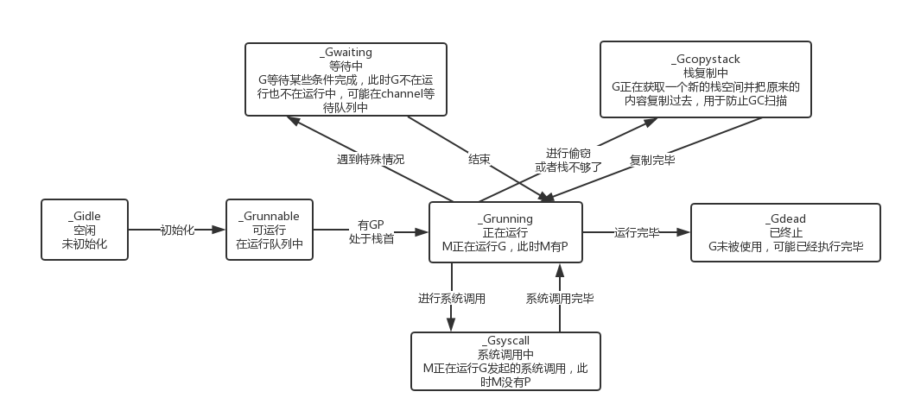
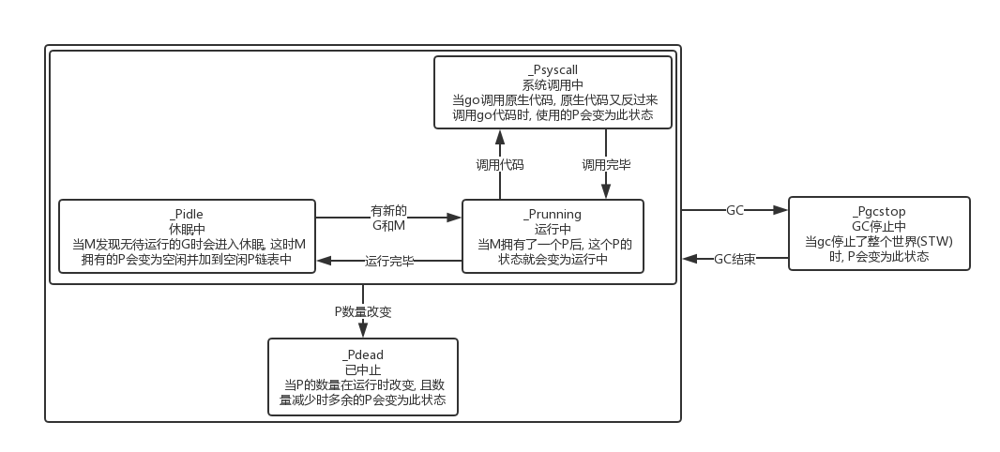
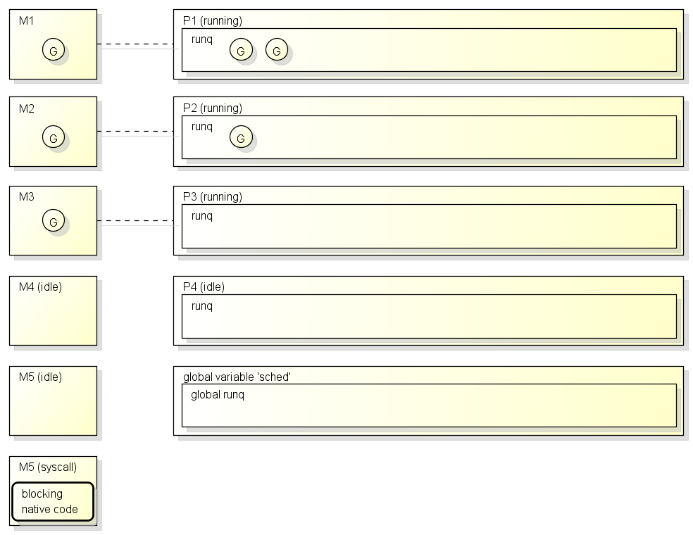

# go协程原理

> Author: huzi(moustache) 
>
> Date: 18-9-18 17:01

参考博客：https://www.cnblogs.com/zkweb/p/7815600.html

参考知乎：https://www.zhihu.com/question/32218874

## 什么是协程？为什么需要协程？

协程就是用户级线程，这是大家都知道的。它更轻量，更快，这也是大家都知道的。（废话）

但实际上，协程干的事情如下：

1. 保存了CPU（寄存器）信息和函数中断地点信息。协程切换不过就是保存寄存器+跳转到另一个函数的半中间。
2. 和线程不同，它只保存了CPU的信息，不会像线程一样，保存缓存Cache之类的信息，因此创建消耗的资源会比线程小。
3. 协程调度实际上是主动调度，而不是被动调度，即协程自己让出CPU，调度器不会抢占。因此上下文切换变少，开销没有这么大。
4. 协程实际上“用代码来表示状态，而不是维护一坨数据结构来表示状态”。
5. 协程主要解决了“回调地狱“的问题，对比回调来说，可读性更高了。
6. 协程主要用于I/O密集型程序，在CPU密集型程序作用不大。

## GMP

- G：goroutine，受管理的轻量线程。

  状态转移图如下：

  

- M：machine，运行轻量线程的工具，在1.9.2版本中，等同于系统线程。

  状态转移图如下：

  

- P：process，代表M运行G所需要的资源，默认等于CPU核心数。

  状态转移图如下：

  

- 由以上可得知，总共有五个部分的列表：

  - 局部G无锁循环队列，capacity为256
  - 全局G有锁链表。放在sched中
  - 空闲M链表。放在sched中
  - 空闲P链表。放在sched中
  - channel队列。放在sched中

## 工作流程

示例程序：

~~~go
package main

import (
    "fmt"
    "time"
)

func printNumber(from, to int, c chan int) {
    for x := from; x <= to; x++ {
        fmt.Printf("%d\n", x)
        time.Sleep(1 * time.Millisecond)
    }
    c <- 0
}

func main() {
    c := make(chan int, 3)
    go printNumber(1, 3, c)
    go printNumber(4, 6, c)
    _, _ = <- c, <- c
}
~~~

详情请见博客，并不复杂。

## 代码分析

