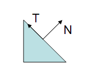
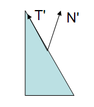

# 法向量矩阵变换问题

> Author：moustache(huzi) 
>
> Date：18-10-9

参考博客：https://www.qiujiawei.com/linear-algebra-18/

## 法向量的矩阵变换

法向量的矩阵变换和MVP矩阵不同。如果不是uniform变换，就会出问题：

正确的矩阵为：
$$
G = ((MVP)^{-1})^{t}
$$
详情请见博客。