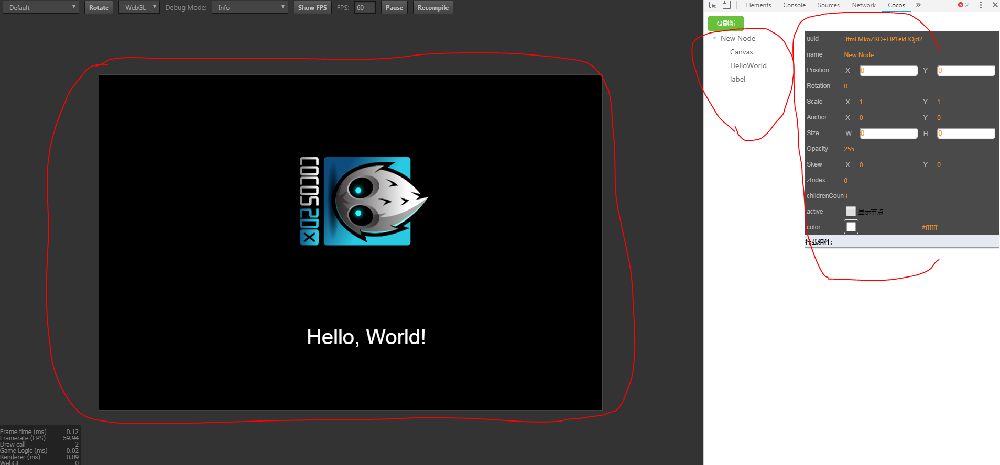

# 项目说明-20180720-huzi

> Author：huzi Tutor：lionqu Date：2018年7月20日 星期五

## 项目需求

在开发时，我们希望能在运行时更改元素的属性，这样可以加快debug的速度。并且，可以同时调节代码在runtime时的状态。因此，我们需要一个工具，来帮助我们动态的查看节点的属性和对应的状态。

## 项目说明

依赖项目：https://github.com/tidys/CocosCreatorPlugins/tree/master/CocosCreatorInspector

本项目在上述项目的基础上，开发并完善一个依赖在chrome上的cocos调试插件，该插件类似于cocoscreator中的属性检查器，可以在程序运行的时候，对程序中的节点属性实时展示和修改，节点属性修改后会渲染到页面中。具体细节如下：

项目通过chrome插件形式运行，运行后UI界面如图所示：

- 左半是cocos渲染的游戏界面
- 中间是节点树
- 右边是属性框

预期功能如下：

1. 在节点树中，查看节点间的层级关系（树形关系）
2. 在节点树中，点击节点，可以在属性框中显示节点的各种属性，
3. 修改属性框中的属性后，会将该属性渲染到实际的游戏界面上
4. 在属性框中，可以通过左右拖动修改节点中的属性
5. 点击节点树的节点，可以高亮显示游戏界面中对应物体的边框
6. 点击游戏界面的物体，可以聚焦节点树的对应节点

## 预计计划

本项目预期在三周之内完成，预期进度如下。

- 本周（18.7.16 - 18.7.22）
  1. 学习vue基础语法，学习chrome插件原理 ------ 已完成
  2. 阅读整个项目代码 ------ 已完成
- 第一周（18.7.23 - 18.7.29）
  1. 实现预期功能2和预期功能3
  2. 可以通过模板，比较轻松的添加和删除属性。
- 第二周（18.7.30 - 18.8.2）
  1. 实现预期功能4和预期功能5
  2. 改进UI，使其更美观
- 第三周（18.8.3 - 18.8.9）
  1. 实现预期功能6
- 额外计划
  1. 重新设计项目结构
  2. 在chrome商店中上架