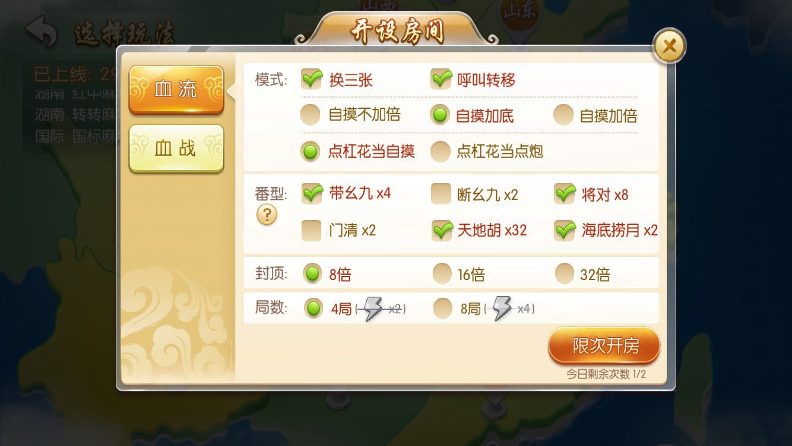

# 麻将体验报告

> Author: huzi(moustache) 
> Date: 18-7-29 19:28

## 整体体验

1. 进入的游戏logo动画特殊，让人印象深刻。

2. 游戏主界面简洁易懂，干净明朗。可以直接打牌，没有额外的操作。

3. 进入游戏，几张新手教程后，直接开打。游戏整体使用3D动作，十分新颖，不像一般的棋牌那样。而且打完一把血流花费的时间非常的短，多快好省。（然而输的豆子一点都不少）

4. 根据地图，可以选择全国各个地方的麻将，很特殊。

5. 大胜利的结算动画很帅。（就这个B把我豆子赢光了）

6. 我没想过麻将还有排位系统。。。

7. 进入好友房，和好友开一把。

总结：和想象中的麻将游戏不太一样，由于3D动作的原理，感觉十分新颖。虽然我不会玩，只是打个热闹，但是打的挺开心的。（打到豆都没了）

## 作为一个不会玩的人的感觉

1. 对于一个不会玩麻将的人来说，新手介绍不够详细，打牌打得一脸懵。比如：

   - 第一次看到选类型，还以为那种类型的牌要留着，结果最后全剩下这种类型的牌了。

     

   - 遇到出现三角形胡牌提示的时候，不知道怎么操作，看不懂什么意思。

   - 对碰杠胡没有解释，碰了一堆不知道怎么胡。

     

     （三个人都胡了，我碰了半天，然后？？？？？？？）

   - 结算流程不是很详细，输了不知道咋输的。。。

2. 每天两次的4000豆子补给对于新手玩家来说是个好办法（虽然两把就输完了）。

 3. 各种登录和活动看起来挺多，但是加起来感觉还不够输一把的。。。（还不够4000）

 4. 游戏中的拍桌子之类的动画效果十分搞笑。（快点啊，我等到花儿都谢了）

 5. 方言音效很有趣，希望有更多的方言语音。

## 一些改进点（或者是BUG？）

1. IOS系统出牌时，牌向上拖容易触发菜单栏。（后来知道可以双击）
2. 点击活动"夏日冲浪领礼包"，退出后，音乐没了。

3. 在大厅中，循环音乐有一瞬间的停顿。
4. 福利按钮右上角的红点无法消除。

3. 重庆和云南全是血流和血战。

4. 二人三人好友房麻将难找，没有快捷路径。最后一个一个找才找到。

5. 好友房没有音乐。

## 后话

最后分享一位牌运极差的老哥（右边那位），连续三排的万也算是前所未见了=。=

