# Unity 编写并使用Android包

> Author: ziang.hu <br>Date: 19.1.15 15:39

## 编写Android的aar包

### 1. 创建安卓项目和Module

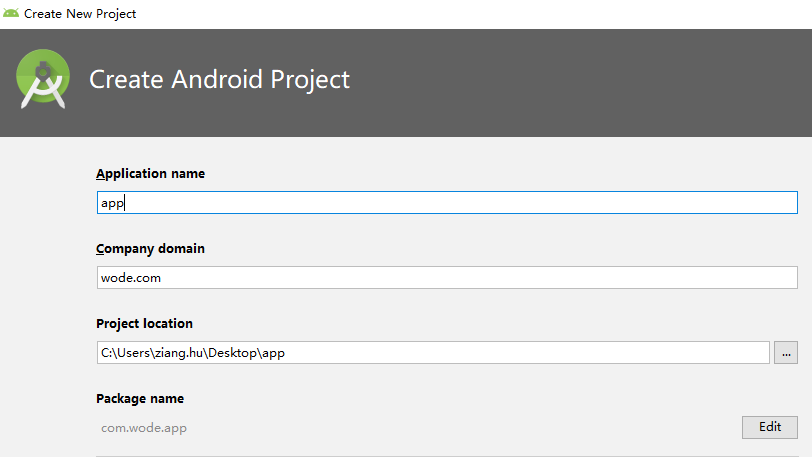

PS：其中安卓项目包名并不是很重要，可以随便设置。

选好对应的SDK后新建项目，Activity选择Empty Activity。（其他Activity也行，但是其实并不会使用Activity，无所谓）

### 2. 新建Library Module

File -> New -> New Module，选择Android Library。

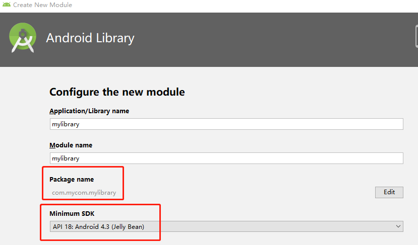

PS：这个module是真正用来打包的，**Minimum SDK要设置成和Unity一样*，包名可以设置成一样也可以不设置**。

至此，项目下面就有两个Module，app和mylibrary。之后的大部分操作都在mylibrary这个文件夹中操作。

### 3. 引用Unity中的jar包

去Unity的安装目录搜索classes.jar，可以找到Unity的jar包。（如果有多个的话，任取一个即可）

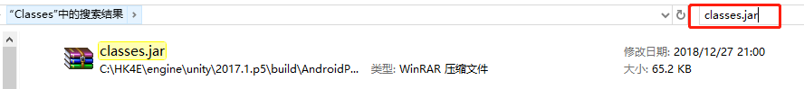

复制该包到mylibrary/libs下，然后将classes.jar添加成module的第三方库。（右键 -> Add as Library）

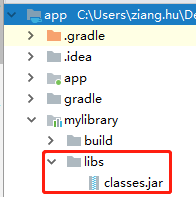

### 4. 配置build.gradle

接下来需要修改mylibrary下的build.gradle配置文件，修改的地方如下。

```java
android {
    // 编译SDK版本，和Unity同步（Unity中的版本一般比较低）
    compileSdkVersion 24

    defaultConfig {
        // 最小SDK版本，和Unity同步
        minSdkVersion 18
        // 目标SDK版本，和编译SDK版本相同
        targetSdkVersion 24
        versionCode 1
        // 版本名称，和Unity同步
        versionName "1.0"
    }
}

// ...

dependencies {
    implementation fileTree(include: ['*.jar'], dir: 'libs')
    // Unity中不需要appcompat支持，删除或注释下面一行
    // implementation 'com.android.support:appcompat-v7:28.0.0'
    testImplementation 'junit:junit:4.12'
    androidTestImplementation 'com.android.support.test:runner:1.0.2'
    androidTestImplementation 'com.android.support.test.espresso:espresso-core:3.0.2'
    implementation files('libs/classes.jar')
}
```

### 5. 编写实际的代码

准备工作做好后，接下来就可以编写实际要用到的代码了。

复制app文件夹下的MainActivity到mylibrary中的指定位置。（Activity就这个作用了）

修改包名，修改MainActivity中的基类为UnityPlayerActivity，并添加引用，删掉setContentView函数。

修改后的文件如下：

```java
package com.mycom.mylibrary;

import android.os.Bundle;
import com.unity3d.player.UnityPlayerActivity;

public class MainActivity extends UnityPlayerActivity {

    @Override
    protected void onCreate(Bundle savedInstanceState) {
        super.onCreate(savedInstanceState);
    }
}
```

PS：AS里面有自动添加包依赖的功能，具体可以百度。

之后就可以在MainActivity中添加所需要的功能，举例如下：

```java
package com.mycom.mylibrary;

import android.os.Bundle;
import com.unity3d.player.UnityPlayerActivity;

public class MainActivity extends UnityPlayerActivity {

    @Override
    protected void onCreate(Bundle savedInstanceState) {
        super.onCreate(savedInstanceState);
    }

    // static 函数/变量
    public static int sa = 10;
    public static String sb() {
        return "sb";
    }

    // 类成员 函数/变量
    public int a = 100;
    public String b() {
        return "b";
    }
}
```

### 6. 修改Manifest

打开app中的AndroidManifest.xml，拷贝第一行的内容到mylibrary的AndroidManifest.xml中。（Activity还有这个作用）

```xml
<?xml version="1.0" encoding="utf-8"?>
<manifest xmlns:android="http://schemas.android.com/apk/res/android"
    package="com.mycom.mylibrary" />
```

PS1：可能有很多教程会说在这里加一些东西，这里可以选择不加也可以选择加。

PS2：如果用到了安卓某些需要权限的包，需要在这里添加用户权限。

```xml
<?xml version="1.0" encoding="utf-8"?>
<manifest xmlns:android="http://schemas.android.com/apk/res/android"
    package="com.mycom.mylibrary">

    <!-- 在此处添加用户权限，如下 -->
    <!-- uses-permission android:name="android.permission.ACCESS_WIFI_STATE"></uses-permission -->
    <!-- uses-permission android:name="android.permission.ACCESS_NETWORK_STATE"></uses-permission -->
</manifest>
```

### 7. 打成aar包

Build -> Make Project，成功后，可以在build/outputs/aar目录下找到对应的aar包。

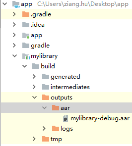

## 使用Android的aar包

### 1. 添加aar包

在Assets文件夹中创建Plugins文件夹，然后再Plugins中创建Android文件夹，最后把之前编写的aar包移动到Android目录下。

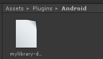

打开aar包，删掉里面的libs/classes.jar，该包就是我们之前导入的Unity包，由于Unity编译的时候自带该包，因此如果不删除的话会引用两次导致报错。

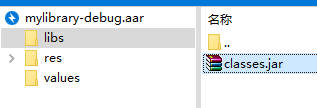

PS：当如果有多个包或者Android文件夹有AndroidManifest.xml时，会进行合并。具体细节可以见[官网](https://docs.unity3d.com/2017.4/Documentation/Manual/android-manifest.html)。

### 2. 编写脚本使用

在脚本中使用Android包中的接口，举例如下：

Test.cs

```c#
using System.Collections;
using System.Collections.Generic;
using UnityEngine;

public class Test : MonoBehaviour
{

	// Use this for initialization
	void Start()
	{
		AndroidJavaClass jc = new AndroidJavaClass("com.unity3d.player.UnityPlayer");
		AndroidJavaObject mainActivity = jc.GetStatic<AndroidJavaObject>("currentActivity");

		int sa = mainActivity.GetStatic<int>("sa");
		string sb = mainActivity.CallStatic<string>("sb");
		int a = mainActivity.Get<int>("a");
		string b = mainActivity.Call<string>("b");
		Debug.LogWarning("Static a: " + sa);
		Debug.LogWarning("Static b: " + sb);
		Debug.LogWarning("a: " + a);
		Debug.LogWarning("b: " + b);
	}
}
```

PS：对应的代码只有在Android平台上才能运行，因此需要将项目打包到真机或者模拟器上才能看到效果。

### 3. 打包运行

File -> Build Settings，选择Android一项，点击下面的Player Settings，修改项目的属性。

设置项目的属性和安卓包中的属性一致。（包名可以不一致）

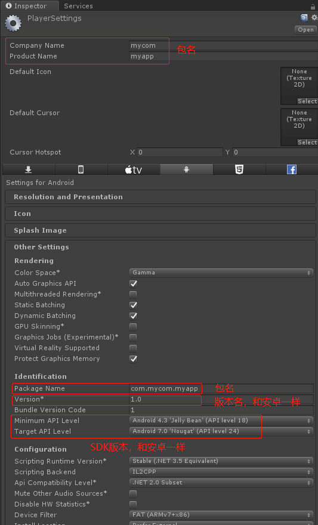

点击build，打包成apk。**由于Unity默认的Manifest文件不包含新加入的包，所以此时项目运行后会报错，找不到对应的函数和变量！**接下来就需要修改Unity默认的Manifest文件。

找到Unity项目目录下的Temp/StagingArea/AndroidManifest-main.xml文件。文件内容如下：

```xml
<?xml version="1.0" encoding="utf-8"?>
<manifest xmlns:android="http://schemas.android.com/apk/res/android" package="com.mycom.myapp" xmlns:tools="http://schemas.android.com/tools" android:installLocation="preferExternal" android:versionName="1.0" android:versionCode="1">
  <supports-screens android:smallScreens="true" android:normalScreens="true" android:largeScreens="true" android:xlargeScreens="true" android:anyDensity="true" />
  <application android:theme="@style/UnityThemeSelector" android:icon="@drawable/app_icon" android:label="@string/app_name">
    <!-- 注意此处 -->
    <activity android:name="com.unity3d.player.UnityPlayerActivity" android:label="@string/app_name">
      <intent-filter>
        <action android:name="android.intent.action.MAIN" />
        <category android:name="android.intent.category.LAUNCHER" />
      </intent-filter>
      <meta-data android:name="unityplayer.UnityActivity" android:value="true" />
    </activity>
  </application>
  <uses-sdk android:minSdkVersion="18" android:targetSdkVersion="24" />
</manifest>
```

这个文件就是默认的Manifest文件，包含了我们刚刚设置的信息。我们可以看到，里面的activity中的name属性是com.unity3d.player.UnityPlayerActivity，并不是我们的类。需要手动改成我们自己的类。

将该文件复制到Assets/Plugins/Android下并重命名为AndroidManifest.xml，修改name属性为我们刚刚打的包中的类。

```xml
<!-- 包名是aar的包名，对应的类是aar包中继承UnityPlayerActivity的类 -->
<activity android:name="com.mycom.mylibrary.MainActivity" android:label="@string/app_name">
```

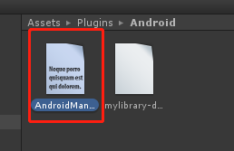

此时，重新打包一次即可。

模拟器上运行结果如下，结果正确！

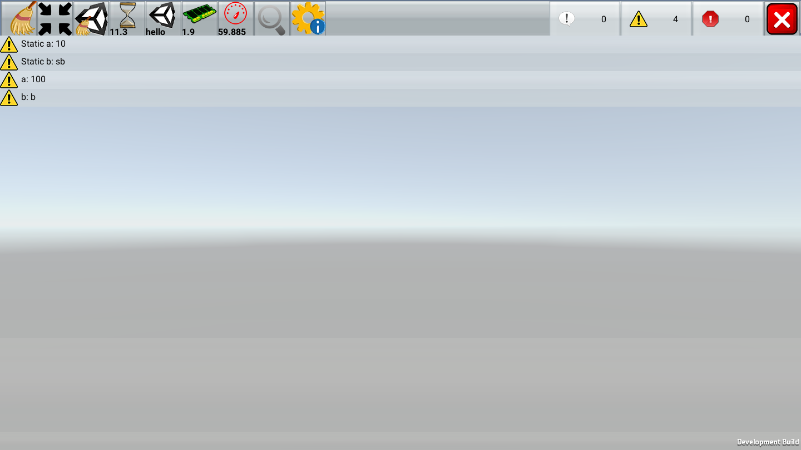

PS：使用的Log工具是一个在Asset Store中免费的工具，名字叫Log Viewer，也可以去[这里](https://assetstore.unity.com/packages/tools/log-viewer-12047)下载。

## 遇到的一些坑和Bug处理

1. 运行apk包后报错：

   错误如下：

   

   解决方法：没有自己手动修改默认的Manifest或者修改错误。按照上面的操作重新修改，注意是安卓包里面的类。

2. 在手机上安装apk后，发现有两个图标：

   错误如下：

   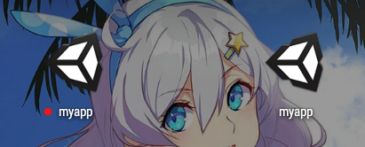

   解决方法：打开项目目录下的Temp/StagingArea/AndroidManifest.xml，会发现里面有两个activity。

   ```xml
   <?xml version="1.0" encoding="utf-8"?>
   <manifest xmlns:android="http://schemas.android.com/apk/res/android" xmlns:tools="http://schemas.android.com/tools" package="com.mycom.myapp" android:versionCode="1" android:versionName="1.0" android:installLocation="preferExternal">
     <!-- ... -->
     <application android:icon="@drawable/app_icon" android:label="@string/app_name" android:theme="@style/UnityThemeSelector" android:debuggable="true" android:isGame="true" android:banner="@drawable/app_banner">
       <activity android:name="com.unity3d.player.UnityPlayerActivity" android:label="@string/app_name" android:screenOrientation="fullSensor" android:launchMode="singleTask" android:configChanges="mcc|mnc|locale|touchscreen|keyboard|keyboardHidden|navigation|orientation|screenLayout|uiMode|screenSize|smallestScreenSize|fontScale|layoutDirection">
         <!-- ... -->
       </activity>
       <activity android:name="com.mycom.mylibrary.MainActivity" android:screenOrientation="fullSensor" android:launchMode="singleTask" android:configChanges="mcc|mnc|locale|touchscreen|keyboard|keyboardHidden|navigation|orientation|screenLayout|uiMode|screenSize|smallestScreenSize|fontScale|layoutDirection">
   	<!-- ... -->
     </application>
     <!-- ... -->
   </manifest>
   ```

   修改默认的Manifest即可。

## AS上的一些坑

1. build Unity打包的Gradle出错。

   错误如下：

   ```
   Caused by: java.lang.RuntimeException: com.android.builder.dexing.DexArchiveMergerException: Error while merging dex archives: C:\HK4E\project\HK4E\Miscs\android\BH4\unity-test-project\build\intermediates\transforms\dexBuilder\debug\8, C:\HK4E\project\HK4E\Miscs\android\BH4\unity-test-project\build\intermediates\transforms\externalLibsDexMerger\debug\0
   ```

   解决方法：在build.gradle中的defaultConfig中添加一行，如下：

   ```
   defaultConfig {
       // ...
       multiDexEnabled true
   }
   ```

   添加后make仍然会出错，但是可以正常运行和debug。

2. 只能打build包，无法打release包。

   在Android studio内打开terminal。<br>
   运行命令**gradlew -v**，没安装gradle会进行首次安装。结果如下：

   ```
   ------------------------------------------------------------
   Gradle 4.4
   ------------------------------------------------------------
   
   Build time:   2017-12-06 09:05:06 UTC
   Revision:     cf7821a6f79f8e2a598df21780e3ff7ce8db2b82
   
   Groovy:       2.4.12
   Ant:          Apache Ant(TM) version 1.9.9 compiled on February 2 2017
   JVM:          1.8.0_191 (Oracle Corporation 25.191-b12)
   OS:           Windows 10 10.0 amd64
   ```

   输入**gradlew clean**清理项目，然后再输入**gradlew clean**构建项目，即可看到release版本的包。<br>
   **PS：本项目中build会报错，但是不影响结果**

3. 项目或AS的依赖下载不下来，翻墙也没下载下来：

   在项目的build.gradle中添加国内的mavenCentral仓库：

   ```
   buildscript {
       repositories {
           // ...
           mavenCentral()
       }
   }
   ```

   或

   ```
   allprojects {
       repositories {
           // ...
           mavenCentral()
       }
   }
   ```

4. 项目在AS自带的模拟器上运行效果不对：

   AS自带的模拟器底层架构和真机不同，可以使用其他的商业模拟器进行debug。<br>
   参考博客：[ADB连接Android模拟器（本文章以网易MUMU为例）](https://blog.csdn.net/qq544649790/article/details/83022507
   )<br>
   PS：AS已经自带了adb.exe，默认目录为C:\Users\你的用户名\AppData\Local\Android\Sdk\platform-tools，不用单独下载。

5. 无法引用自己新增加的第三方aar包中的类。

   aar包打包后，不会将自己依赖的aar包一同打包，需要手动添加，如果是Unity项目，直接把依赖aar包放入Assets/Plugins/Android目录下即可。<br>
   参考博客：[Android Studio多Module使用 aar 依赖包 丢包解决](https://www.cnblogs.com/bluestorm/p/6757999.html)