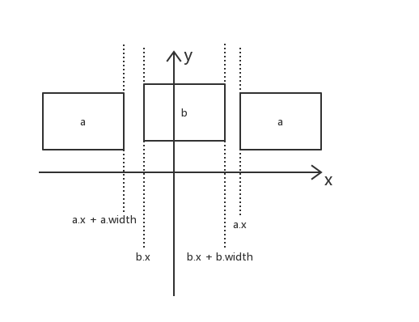

# 米忽悠面试

## 电话面试：

### 如果让你实现一个排行榜，这个排行榜是一定时间刷新一次的，只显示前100名，你要怎么实现？

分析：由于排行榜只显示前100名，因此推测用户积分的增长更倾向于少部分用户大量增长，大部分用户少量增长。

理论实现：定义一个结构体，该结构体以key-value形式储存数据。其中key代表玩家的id，value代表玩家距离上一次更新（数据库数据）的差值。当该表满时或者定时器到时，更新该表到数据库中。由于一定时间后，增长用户的积分变少，该表可以满足需求。

### 你怎么实现棋牌游戏的输赢判断呢？

分析：棋牌游戏的输赢不仅仅是要判断当前情况下的输赢，还要有可扩展性。

理论实现：通过建立一个图，图中每个节点代表一种情况，两个节点的边的关系代表输赢关系。这样就可以实现输赢判断。当新增条件时，只需要新增一个节点即可。

## 二面：

### 手写代码实现LRU：

主要是怎么能够快速的寻找到最远未被使用的页。

我的想法：

1. 通过key-value字典储存页（实际上储存的是双向链表的节点）
2. 通过双向链表快速寻找到最远未被使用的页。
   - 每次一个页使用时，将该页从链表中拿出来，然后放到双向链表的最后。
   - 当发生缺页时，将链表中第一个元素拿出来，该元素即代表最远未被使用的页。

具体实现就不展开了。

### 怎么实现斜面上的动画效果，并使其显的很真实？

我的想法：

通过在角色脚底添加触发器，当触发器和地面进行接触时，停止动作，即可实现看起来真实的动画效果。

### 三面：

###  如何判断两个正交的AABB相交？

我的想法：

如何判断两个AABB（a和b）绝对不相交？

AABB数据结构如下：

~~~c++
struct AABB {
	int x;
	int y;
	int width;
	int height;
};
~~~

在x轴，不相交的情况有两种：

即 (a.x + a.width < b.x) || (b.x + b.width < a.x)

在y轴，同理。即 (a.y + a.height < b.y) || (b.y + b.height < a.y)

因此，结果如下：

~~~c++
bool isIntersect(const AABB &a, const AABB &b) {
    return !((a.x + a.width < b.x) || (b.x + b.width < a.x) ||  (a.y + a.height < b.y) || (b.y + b.height < a.y));
}
~~~

### 如何判断两个斜方向的AABB相交？

一个比较玄学，没数学证明的方法。

以一个AABB作为平面直角坐标系，对x，y，分别将另一个AABB做映射，映射到1维上。分别判断是否相交。

两个AABB交换，重复上述动作。

如果四个判断都相交，则两个AABB相交。

### 如何判断一个链表有环？并求出环长？入环节点？

判断有环：

见该博客：http://www.cnblogs.com/zhyg6516/archive/2011/03/29/1998831.html

简单来说，就是用两个指针，一个一次走一步，一个一次走两步，如果有环，则两个指针会相遇。

求出环长：

见该博客：http://www.cnblogs.com/xudong-bupt/p/3667729.html

执行一次一，得出碰撞点。

在碰撞点的基础上，遍历一遍直到回到原点，长度即为环长。

求出入环节点：

假设入环长度为len，环长为R，碰撞点到入环节点的距离为x，则可得
$$
p1 = len + x \\
p2 = len + x + n * R  \\
p2 = 2p1 \\
len + x = n * R \\
len = n * R - x
$$
即可得出入环节点。

### 如何判断两个链表有交点？并求出交点？

见该博客：https://blog.csdn.net/jiqiren007/article/details/6572685

将第一个链表的尾部指向第二个链表的头部，可将问题等价变换：

两个链表有交点？ => 新的合成链表是否有环？

见上题。